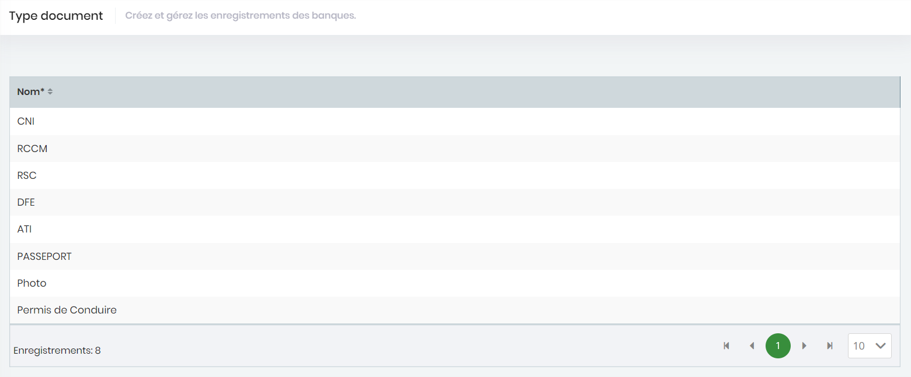

# Type de document

Ce menu affiche la liste des différentes types de document pour la validation des inscriptions des acteurs.


Cette liste n'est pas modifiable car représentant des informations systèmes.


