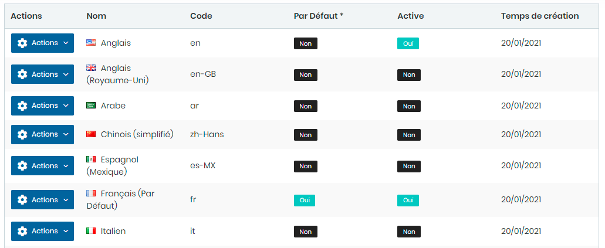
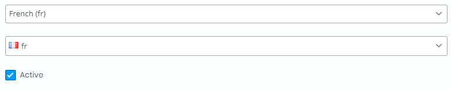
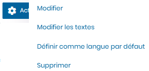

# Langues

Cette fonctionnalité nous permet d'ajouter des langues de traduction.

### **Edition de la fiche : Langue**

**NB :** Seules les zones en astérisque (\*) de cet écran sont obligatoire.

* **Langue**: indiquez la langue.&#x20;
* **Code** : indiquez le code

* **Modifier** : Cliquer sur le bouton "**Modifier"** pour changer la langue
* **Modifier les textes** : Cliquer sur le bouton "**Modifier textes"** pour changer les textes de traduction de la langue.
* **Définir langue par défaut** : Définir la langue  comme langue par défaut
* **Supprimer** : Supprimer le langue sélectionnée.

