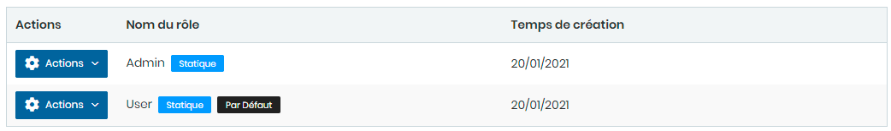
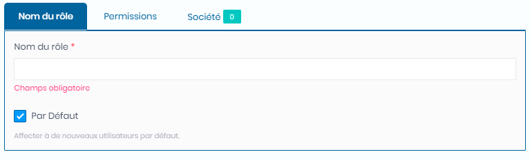
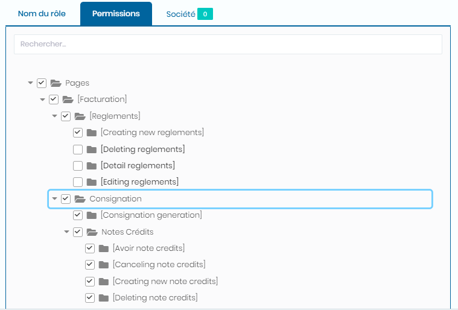
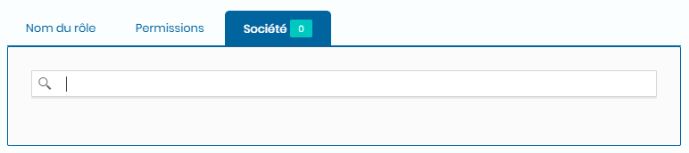

# Rôles

Cette fonctionnalité nous permet de gérer les rôles et les droits des utilisateurs.

### **Edition de la fiche : Rôle**

L' écran de **Rôle** se divise en trois parties.&#x20;

* La première partie concerne les informations générales sur le rôle .
* La seconde partie gère les permissions ou droits d'utilisateur.
* La troisième partie gère les  autorisation sur les sociétés.

**NB :** Seules les zones en astérisque (\*) de cet écran sont obligatoire.

**1ère partie** :

* **Nom du rôle** : indiquez le nom.&#x20;
* **Par Défaut**: Indiquez le rôle par défaut

**2ème partie** : Onglet **Permissions**

* **Cochez les permissions correspondants aux rôles**

**3ème partie** : Onglet **Sociétés**

* **Sélectionnez les sociétés autorisés**&#x20;

