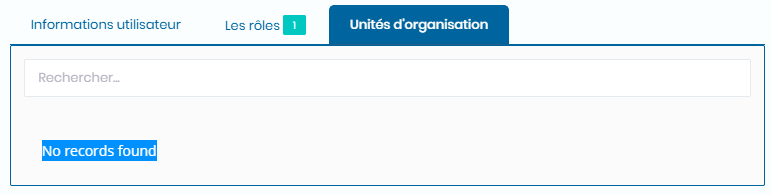

# Utilisateurs

Cette fonctionnalité nous permet de d'attribuer des droits aux utilisateurs.

### **Edition de la fiche : Utilisateur**

L' écran de **Utilisateur** se divise en trois parties.&#x20;

* La première partie concerne les informations générales sur l'utilisateur.
* La seconde partie gère les groupes utilisateurs ou rôles.
* La troisième partie gère les  autorisations aux unités d'organisations.

**NB :** Seules les zones en astérisque (\*) de cet écran sont obligatoire.

**1ère partie** : onglet **Informations utilisateur**

* **Nom** : indiquez le nom.&#x20;
* **Nom de famille** : indiquez le nom de famille
* **Adresse e-mail** : indiquez l'adresse mail
* **Nom d'utilisateur** : Indiquez le nom d'utilisateur

**2ème partie** : onglet **Les rôles**

* **Indiquez les rôles**&#x20;

* **Indiquez les unités d'organisations**

