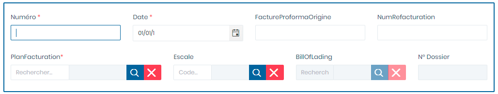

# Avoir - CNS

Cette fonctionnalité permet la gestion des factures Avoirs des Consignations

**Edition de la fiche : Avoir -CNS**

Cette fiche se divise en deux parties. La première partie permet de saisir les informations générales sur la facture avoir. La deuxième partie permet d'ajouter les détails de la facture.

**1ère partie :  informations générales**

**NB :** Seule les zones en astérisque (\*) de cet écran sont obligatoires.

* **Numéro :**  Indiquez le numéro
* **Date :** Indiquez le date
* **Proforma Origine:** Indiquez la facture proforma d'origine
* **N° Refacturation:** Indiquez le numéro de refacturation
* **Plan Facturation:** Indiquez le plan de facturation
* **Escale:** Indiquez l'escale
* **BL/Déclaration:** Indiquez le BL ou la déclaration
* **N° Dossier :** Indiquer le numéro de dossier
* **Client:** Indiquez le client
* **Réceptionnaire:**  Indiquez le réceptionnaire
* **Motif facture:** Indiquez le motif de la facture
* **Divers Nom :** Indiquez le nom divers
* **Divers Adresse 1 :** Indiquez l'adresse 1 diverse
* **Divers Adresse 2 :** Indiquez l'adresse 2 diverse
* **Entête 1 :** Indiquez l'Entête 1
* **Entête 2 :** Indiquez l'Entête 2
* **Pied Facture :** Indiquez le pied facture
* **Exercice :** Indiquez L'Exercice&#x20;
* **Date Comptabilisation  :** Indiquez la date de comptabilisation&#x20;
* **Date Transmission:** Indiquez la date de transmission
* **Date Génération:** Indiquez la date de Génération

**2è partie :  Détails facture**

* **Rubrique:**  Indiquez le numéro
* **Libellé spécifique:** Indiquez le libellé spécifique
* **Quantité :** Indiquez la Qualité
* **Prix:** Indiquez le prix
* **Type Remise :** Indiquez le type de remise
* **Remise :** Indiquez la remise

