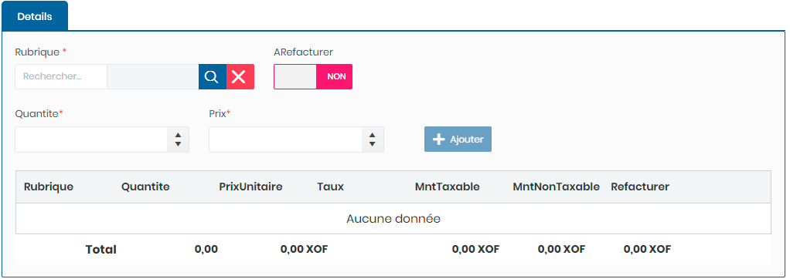

# Notes Débits

Cette fonctionnalité permet la gestion des notes de débit

**Edition de la fiche : Notes Débits**

Cette fiche se divise en deux parties. La première partie permet de saisir les informations générales sur la note de débit. La deuxième partie permet d'ajouter les détails de la note.

**1ère partie :  informations générales**

**NB :** Seule les zones en astérisque (\*) de cet écran sont obligatoires.

* **Date :** Indiquez le date de saisie
* **Date Comptabilisation** : Indiquez la date de comptabilisation
* **Catégorie :** Indiquez la catégorie
* **Escale:** Indiquez l'escale
* **Affréteur :** Indiquez l'affréteur
* **Fournisseur:**  Indiquez le fournisseur
* **FRS Divers:** Indiquez le fournisseur divers
* **Adresse FRS divers:** Indiquez l'adresse du fournisseur divers
* **N° Facture  :** Indiquez le numéro de la facture&#x20;
* **Date Facture  :** Indiquez la date de la facture
* **Objet Facture  :** Indiquez l'objet de la facture

**2è partie :  Détails de la note**

* **Rubrique:**  Indiquez la rubrique
* **A Refacturer**  : Choisir **"Oui"** pour refacturer la rubrique.
* **Quantité :** Indiquez la Qualité
* **Prix:** Indiquez le prix

