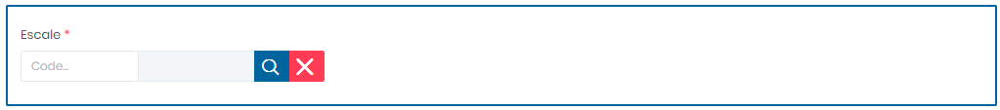

# Génération - EXP

Cette fonctionnalité permet la génération des factures des exportations

**Edition de la fiche : Génération -Export**

**NB :** Seule les zones en astérisque (\*) de cet écran sont obligatoires.

* **Escale :**  Indiquez le numéro d'escale
* **BL/Déclaration :** Indiquez le BL ou la déclaration
* **Payeur :** Indiquez le payeur
* **Plan facture** : Indiquez le plan de facture
* **Zone Livraison** : Indiquez la zone de Livraison
* **Divers payeur** : Indiquez le payeur divers
* **Adresse Divers payeur** : Indiquez l'adresse du divers payeur
* **Facture Auto** : Choisir **"Oui"** pour générer automatiquement les détails de la facture.

