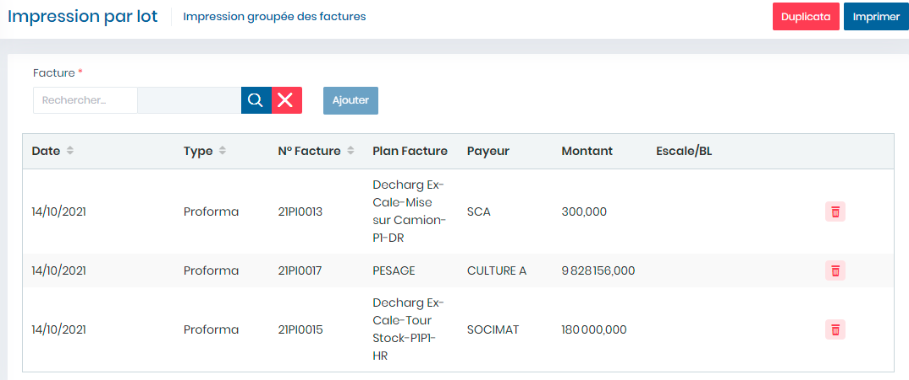

# Impression par lot

Cette fonctionnalité permet d'imprimer des factures par lot

**Edition de la fiche : Impression par lot**

**NB :** Seule les zones en astérisque (\*) de cet écran sont obligatoires.

* **facture :**  Indiquez la facture.
* **Cliquez sur le bouton " Ajouter"** pour afficher les ou la facture dans le tableau ci dessous.
* **Cliquez sur le bouton " Imprimer"** pour imprimer les ou la facture affichée dans le tableau.
* **Cliquez sur le bouton " Duplicata"** pour imprimer des duplicatas des ou de la facture affichée dans le tableau.

