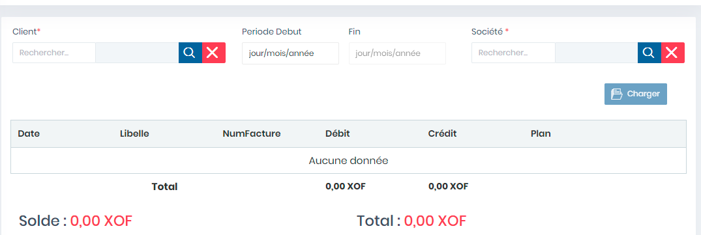

# Relevés Comptes

Cette fonctionnalité permet la gestion des relevés de compte des tiers

**Edition de la fiche : Relevé Comptes**

**NB :** Seule les zones en astérisque (\*) de cet écran sont obligatoires.

* **Client :** Indiquez le client
* **Période Début** : Indiquez la période de début
* **Période Fin :** Indiquez la période de fin
* **Société :** Indiquez la Société
* **Charger :** Cliquer sur le bouton **"Charger"** pour afficher le relevé&#x20;

