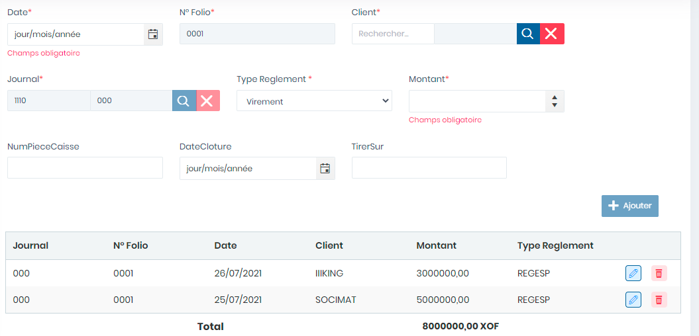

# Saisies Règlements

Cette fonctionnalité permet les saisies les règlements

**Edition de la fiche : Saisie Règlements**&#x20;

**NB :** Seule les zones en astérisque (\*) de cet écran sont obligatoires.

* **Date :** Indiquez le date de saisie
* **N° Folio** : Indiquez le numéro folio
* **Client :** Indiquez le client
* **Journal :** Indiquez le journal
* **Type règlement:** Indiquez le type de règlement
* **Montant:**  Indiquez le montant
* **N° Pièce** : Indiquez le numéro de la pièce
* **Date Clôture** : Indiquez la date de clôture
* **Tirer sûr** : Indiquez la référence du tirage du chèque.

