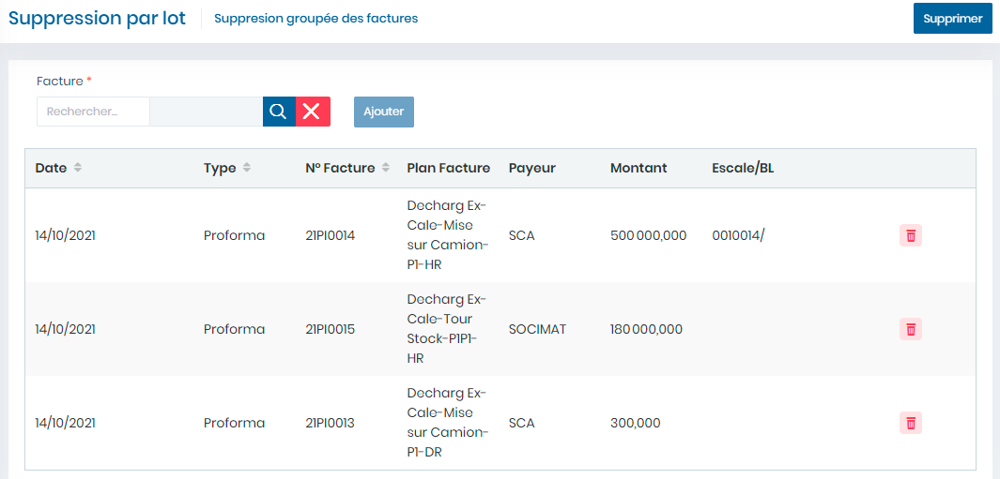

# Suppression par lot

Cette fonctionnalité permet de supprimer des factures par lot

**Edition de la fiche : Suppression par lot**

**NB :** Seule les zones en astérisque (\*) de cet écran sont obligatoires.

* **facture :**  Indiquez la facture.
* **Cliquez sur le bouton " Ajouter"** pour ajouter la facture sélectionnée dans la liste en dessous.
* **Cliquez sur le bouton " Supprimer"** pour supprimer les ou la facture affichée dans le tableau.

