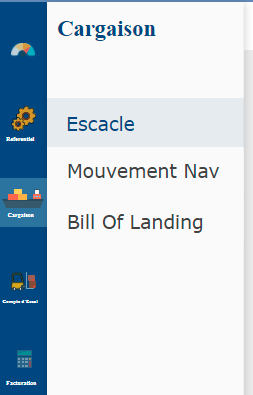

# Gargaison

Ce module regroupe toutes les informations liées au contenu et aux mouvements durant l'accostage d'un navire.

### **Présentation du module : Cargaison**

* **Escale** : cette fonctionnalités permet d'enregistrer les informations shipping du navire.
* **Mouvement navire** : cette fonction retrace les mouvements maritimes effectués par le navire durant le temps de son accostage.
* **Bill of Lading** : Cette fonctionnalités permet d'enregistrer les informations lies aux produits contenus dans le navire.

