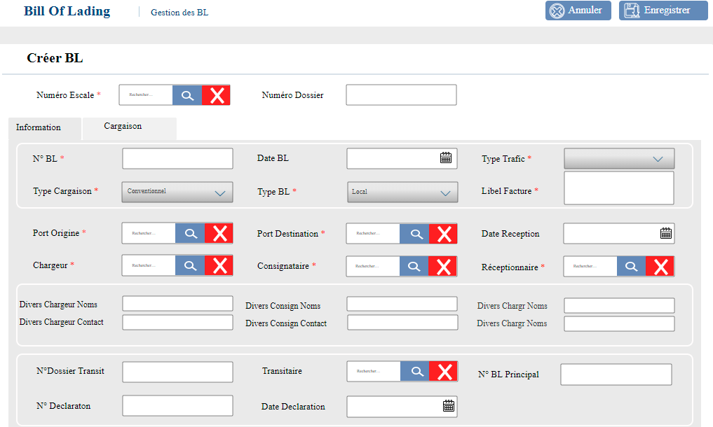
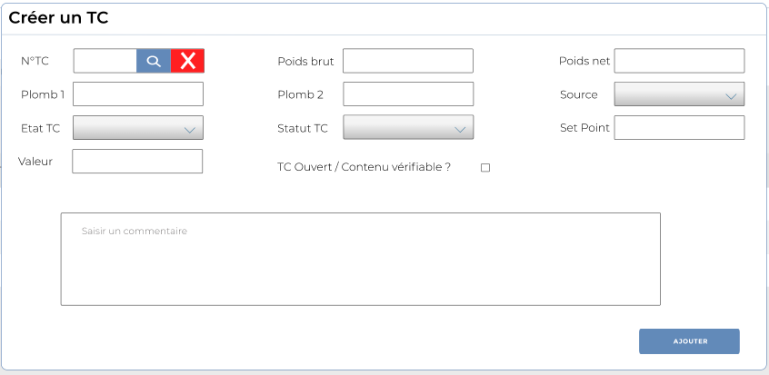
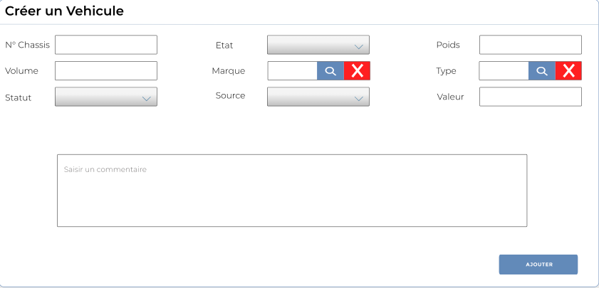
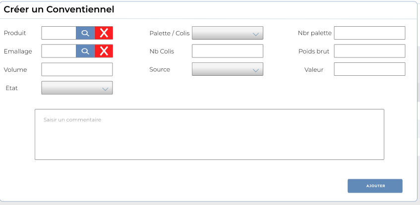

# Bill of lading

Cette option permet de gérer les Bill of lading (BL)

.PNG>)

### **Edition de la fiche : Bill of lading**

Cette fiche se divise en deux parties. La première partie présente les informations de base sur le BL et dans la deuxième partie les information de la cargaison.

**NB:** Seule les zones en astérisque (\*) de cet écran sont obligatoire.

**Onglet : Général**

* **N° Dossier**: Indiquez le numéro de dossier .
* **N° BL** : Indiquez la numéro de BL.
* **Type cargaison**: Indiquez le type de cargaison.
* **Date BL**: Indiquez la date du BL.
* **Type BL** : Indiquez le type de BL.
* **Type Trafic :** Indiquez le type de trafic.
* **Libellé facture :** Indiquez le libellé de la facture.
* **Port origine** : Indiquez le Port d'origine.
* **Chargeur** : indiquez le Chargeur.
* **Port Destination**: Indiquez le port de débarquement.
* **Consignataire** : Indiquez le consignataire.
* **Date réception** : Indiquez la date de réception.
* **Réceptionnaire** : Indiquez le réceptionnaire (client)
* **Divers Chargeur Noms** : Indiquez le nom du chargeur divers.
* **Divers Chargeur Contact** : Indiquez le contact du chargeur divers.
* **Divers Consignataire Noms** : Indiquez le nom du consignataire divers.
* **Divers Consignataire Contact** : Indiquez le contact du consignataire divers.
* **Divers Réceptionnaire Noms** : Indiquez le nom du réceptionnaire divers.
* **Divers Réceptionnaire Contact** : Indiquez le contact du réceptionnaire divers.
* **N° Dossier Transit** : Indiquez le numéro de dossier transit.
* **N° Déclaration** : Indiquez le numéro de déclaration.
* **Transitaire** : Sélectionnez le transitaire.
* **Date Déclaration** : Indiquez la date de déclaration.
* **N° BL Principal** : Indiquez le numéro de BL principal.

**Onglet : Cargaison**

Cet onglet regroupe les informations liées aux contenus de la cargaison.

.PNG>)

1. **"Ajouter TC"**: Cliquez sur le bouton **"Ajouter TC"** pour enregistrer un conteneur.

* **N° TC** : Sélectionnez le numéro du conteneur.
* **Plomb 1**: Indiquez le numéro du Plomb 1.
* **Etat TC** : Sélectionnez l'état du conteneur.
* **Valeur** : Indiquez la valeur du conteneur.
* **Poids brut** : Indiquez le poids brut du conteneur.
* **Plomb 2** : Indiquez le Plomb 2.
* **Statut TC** : Sélectionnez le statut du conteneur.
* **Poids net** : Indiquez le poids net du conteneur.
* **Source** : Sélectionnez la source du conteneur
* **Set Point** : Indiquez le Set point
* **TC ouvert/Contenu vérifiable?** : Si **"Oui"** cocher la case.
* **Commentaire** : Indiquez le commentaire

**2. "Ajouter Véhicule"** : Cliquez sur le bouton **"Ajouter véhicule"** pour enregistrer un véhicule.

* **N° châssis** : Indiquez le numéro du châssis du véhicule.
* **Volume** : Indiquez le volume du véhicule.
* **Statut** : Sélectionnez le statut du véhicule
* **Etat** : Sélectionnez l'état du véhicule.
* **Marque** : Sélectionnez la marque du véhicule .
* **Plomb 2** : Sélectionnez la source la source du véhicule.
* **Poids** : Indiquez le poids du véhicule.
* **Type**  : Sélectionnez le poids net du conteneur.
* **valeur** : Sélectionnez la source du conteneur
* **Commentaire** : Indiquez le commentaire

**3. "Ajouter Convent"** : Cliquez sur le bouton **"Ajouter Convent"** pour ajouter un conventionnel.

* **Produit** : Sélectionnez le produit .
* **Emballage**: Sélectionnez l'emballage.
* **Volume**: Indiquez le volume.
* **Etat** : Sélectionnez l'état.
* **Palette/Colis** : Sélectionnez la palette.
* **Nb Colis** : Indiquez le nombre de colis.
* **Source** : Sélectionnez la source du produit.
* **Nb Palette** : Indiquez le nombre de palette.
* **Poids brut** : Indiquez le poids brut.
* **Valeur** : indiquez la valeur.
* **Commentaire** : Indiquez le commentaire

