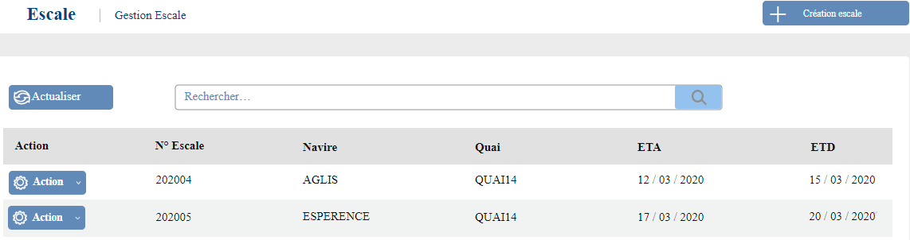
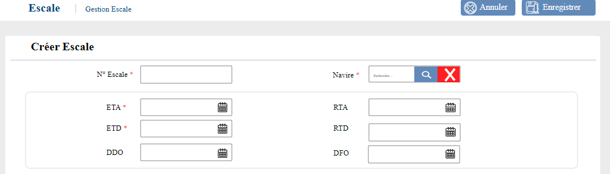
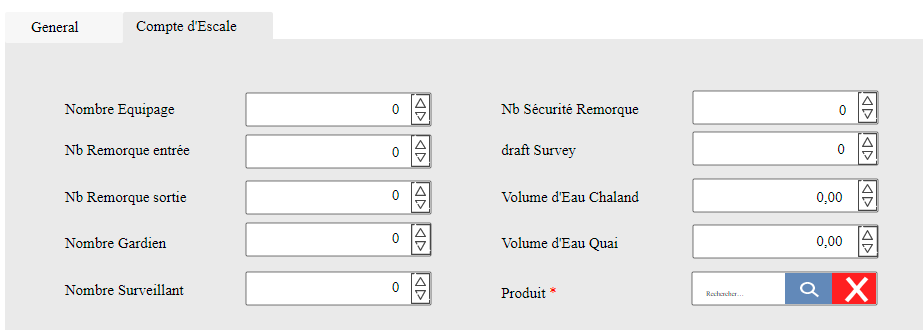

# Escales

Cette option permet de gérer les escales

### **Edition de la fiche : Escale**

Cette fiche se divise en trois parties. Les deux premières partie présentent les informations de base de l'escale et dans la deuxième partie les informations du Compte d'escale.

**NB:** Seule les zones en astérisque (\*) de cet écran sont obligatoires.

* **N° Escale** : Indiquez le numéro de l'escale.
* **Navire**: Sélectionnez le navire.
* **ETA** : Indiquez la date ETA du navire.
* **ETD** : Indiquez la date ETD du navire.
* **RTA**: Indiquez la date RTA du navire.
* **RTD** : Indiquez la date RTD du navire.
* **DDO , DFO**: Ces dates proviennent automatiquement des saisies du mouvement de navire.

**Onglet : Général**

* **Quai** : Indiquez le quai
* **Type escale code** : Indiquez le type d'escale
* **Type Trafic code** : Indiquez le type de trafic
* **Port Embarquement :** Indiquez le port d'embarquement
* **Port Suivant :** Indiquez le port de destination suivant
* **ETA Port suivant :** Indiquez la date de l'ETA du port de destination suivant
* **Affréteur :** Indiquez l'affréteur du navire
* **Manutentionnaire :** Indiquez le manutentionnaire
* **Consignataire :** Indiquez le consignataire
* **Port Débarquement :** Indiquez le port de débarquement
* **Propriétaire :** Indiquez le propriétaire
* **Poids marchandise** : Indiquez le poids des marchandises du navire

.PNG>)

**Onglet : Compte d'escale**

Cet onglet vous permet d'ajouter les informations du compte d'escale  : cliquez sur l'onglet "**Compte Escale**"

* **Nombre Equipage** : Indiquez le nombre de personne de l'équipage
* **Nb Remorque entrée** : Indiquez le nombre de remorque en entrée
* **Nb Remorque sortie** : Indiquez le nombre de remorque en sortie
* **Nombre Gardien** : Indiquez le nombre de gardien
* **Nombre Surveillant** : Indiquez le nombre de surveillant
* **Nb Sécurité Remorque** : Indiquez le nombre de sécurité de remorque
* **Draft Survey** : Indiquez le draft
* **Volume d'au Chaland** : Indiquez le volume d'eau chaland
* **Volume d'eau Quai** : Indiquez le volume d'eau à quai
* **Produit** : Indiquez le produit

