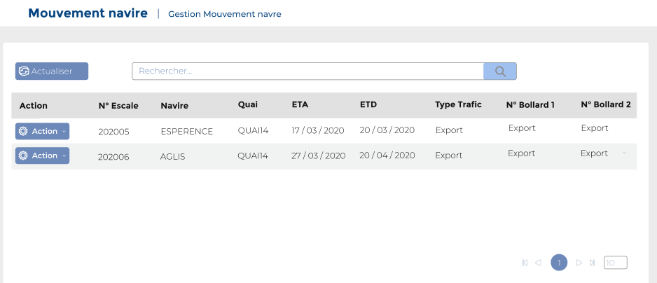
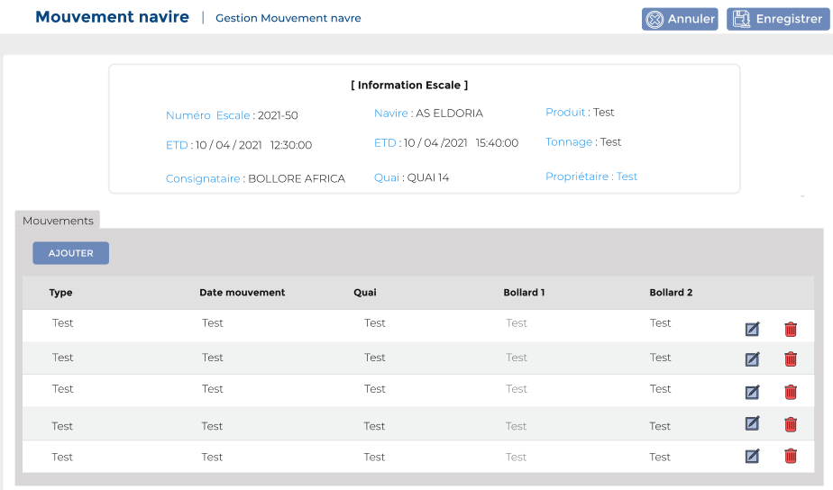

# Mouvements Navires

Cette option permet de gérer les mouvements de navire

### **Edition de la fiche : Mouvement Navires**

Pour ajouter un mouvement navire, il faut cliquer sur le bouton **" Action"**, puis choisir **"Editer "** dans la liste déroulante. &#x20;

.PNG>)

