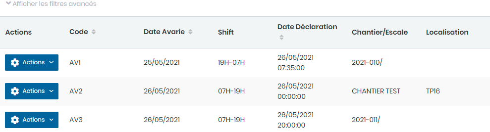

# Avaries

Cette option permet la gestion des Avaries.

### **Edition de la fiche : avaries**

**NB :** Seule les zones en astérisque (\*) de cet écran sont obligatoire.

* **Code :** Indiquez le code
* **Date Avarie :** Indiquez la date d'avarie
* **Shift :** Indiquez le shift
* **Date déclaration :** Indiquez la date déclaration&#x20;
* **Escale :** Indiquez l'escale
* **Produit :** Indiquez le produit
* **Chantier :** Indiquez le chantier
* **Localisation :** Indiquez la localisation
* **Engin origine :** Indiquez l'engin d'origine&#x20;
* **Engin endommagé :** Indiquez l'engin endommagé
* **Type avarie :** Indiquez le type d'avarie
* **Cause avarie :** Indiquez la cause d'avarie
* **Constat :** Indiquez le constat&#x20;
* **Responsable :** Indiquez le responsable&#x20;
* **Intervention :** Indiquez l'intervention&#x20;
* **Temps de réparation :** Indiquez le temps e réparation
* **Cout :** Indiquez le cout&#x20;
* **Mesure prise :** Indiquez la mesure prise
* **Lieu :** Indiquez le lieu
* **Nombre d'intervention :** Indiquez le nombre d'intervention &#x20;
* **Temps d'intervention :** Indiquez le temps d'intervention&#x20;

**Ajout des images des avaries :**

