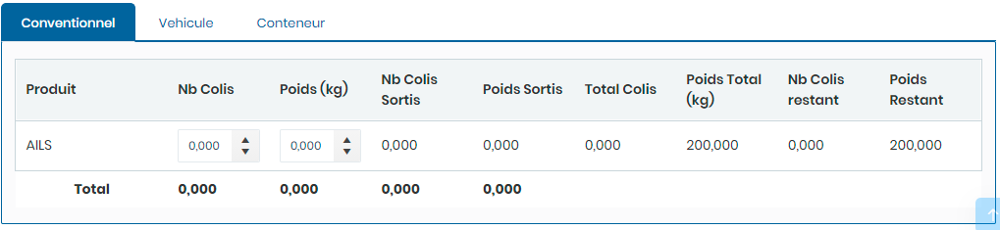

# Bons sorties cargaisons

Cette option permet la gestion des bons de sortie des cargaisons.

**Edition de la fiche : Bon de sortie cargaison**

Cette fiche se divise en cinq (5) parties. La première partie concerne les informations sur le bon de sortie et le Bl concerné . La deuxième partie concerne les engins utilisés pour la sortie des produits de la cargaison. La  troisième partie concerne le type de cargaison en cas de conventionnel. La quatrième partie concerne le type de cargaison en cas de véhicule et La  cinquième partie concerne le type de cargaison en cas de conteneur.

**NB :** Seule les zones en astérisque (\*) de cet écran sont obligatoire.

**1ère partie : Information du Bon e du Bl**

* **Numéro:** Indiquez le numéro du bon
* **Date :** Indiquez la date du bon&#x20;
* **N° BAD :** Indiquez le numéro BAD
* **Date BAD :**  Indiquez la date du BAD
* **Escale  :** Indiquez l'escale
* **Bl/Déclaration :** Indiquez le bl ou la déclaration

**2 ème partie : Les engins utilisés**

* **Chauffeur :** Indiquez le chauffeur
* **Camion  :** Indiquez le camion
* **Remorque :** Indiquez la remorque
* **Chauffeur Divers :** Indiquez le chauffeur divers&#x20;
* **Camion Divers :** Indiquez le camion divers&#x20;
* **Remorque Divers :** Indiquez la remorque divers

.PNG>)

**4 ème partie : l'onglet Conventionnel**&#x20;

* **Nb Colis :** Indiquez le nombre de colis à faire sortir
* **Poids  :** Indiquez la quantité du produit à faire sortir

**5 ème partie : l'onglet Véhicule**

* **Case à cocher  :** Cochez les véhicules à faire sortir&#x20;

**6 ème partie : l'onglet Conteneur**

* **Case à cocher  :** Cochez les conteneurs à faire sortir&#x20;

.PNG>)
