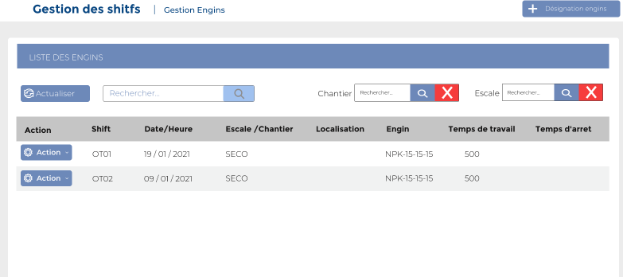
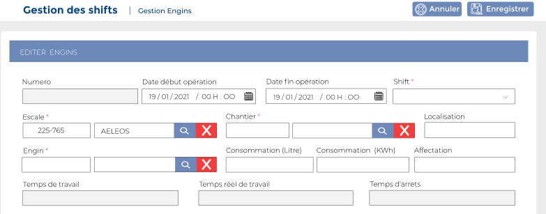
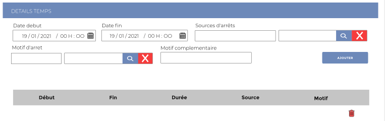

# Gestion Engins

Cette option permet la gestion des engins.

**Edition de la fiche : Gestion Engins**

Cette fiche se divise en deux parties. La première partie concerne l'ajout d'engin. La deuxième partie concerne le temps de travail.

**NB :** Seule les zones en astérisque (\*) de cet écran sont obligatoire.

**1ème partie : Infos escale**

* **Numéro:** Indiquez le numéro
* **Date début opération :** Indiquez la date de début des opérations
* **Date fin opération :** Indiquez la date de fin des opérations
* **Shift :** Indiquez le shift
* **Escale :**  Indiquez l'escale
* **Chantier :** Indiquez le chantier
* **Localisation :** Indiquez la localisation
* **Engin :**  Indiquez l'engin
* **Consommation(Litre) :** Indiquez la consommation en litre
* **Consommation(KWh) :**  Indiquez la consommation en kwh
* **Affectation :** Indiquez l'affectation
* **Temps Travail (Min) :** Indiquez le temps de travail en minute&#x20;
* **Temps réel de travail (Min) :** Indiquez le temps de travail en minute
* **Temps d'arrêt :** Indiquez le temps d'arrêt

**2 ème partie : Infos escale**

* **Date début :** Indiquez la date de début
* **Date fin :** Indiquez la date de fin
* **Sources d'arrêts :** Indiquez la source d'arrêts
* **Motif d'arrêt :** Indiquez le motif d'arrêt&#x20;
* **Motif complémentaire :** Indiquez un motif complémentaire&#x20;

