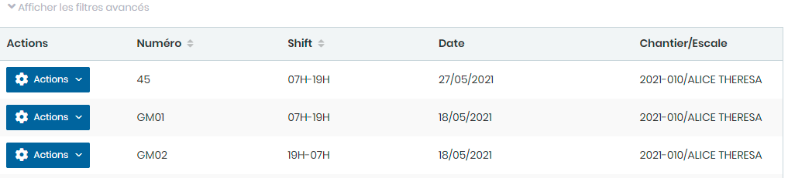
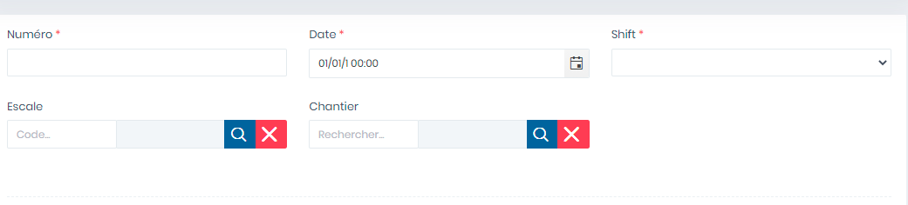
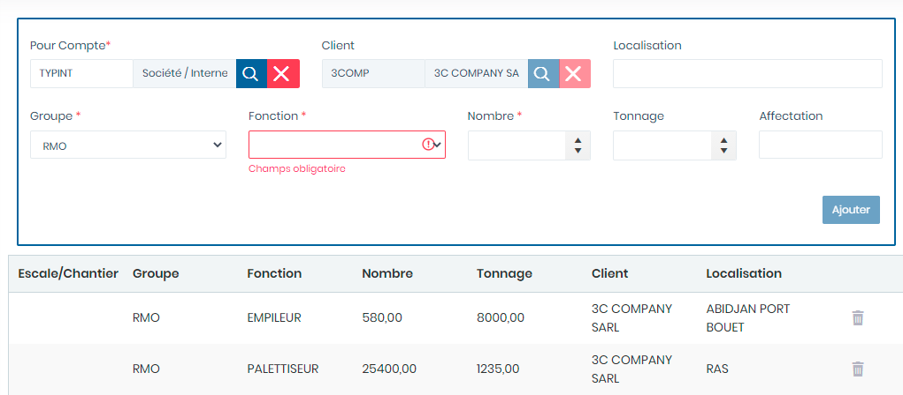

# Gestion Mains d'oeuvre

Cette option permet la gestion de la mains d'œuvres.

**Edition de la fiche : Gestion de la mains d'œuvres**

Cette fiche se divise en deux parties. La première partie permet de saisir les informations générales sur la main d'œuvre. La deuxième partie permet d'ajouter les détail sur l'utilisation de la main d'œuvre.

**1ère partie :  informations générales**

**NB :** Seule les zones en astérisque (\*) de cet écran sont obligatoires.

* **Numéro :**  Indiquez le numéro
* **Date :** Indiquez le date
* **Shift :** Indiquez le shift
* **Escale :** Indiquez l'escale
* **Chantier :** Indiquez le chantier
* **Localisation :** Indiquez la localisation&#x20;
* **Groupe :** Indiquez le groupe
* **Fonction :** Indiquez la fonction

**2è partie : détail sur la main d'œuvre utilisée**

* **Pour compte :**  Indiquez le client ou société
* **Client :** Indiquez le client
* **Localisation:** Indiquez la localisation
* **Groupe:** Indiquez le groupe
* **Fonction :** Indiquez la fonction
* **Nombre :** Indiquez le nombre
* **Tonnage :** Indiquez le tonnage effectué
* **Affectation :** Indiquez le lieu d'affectation

