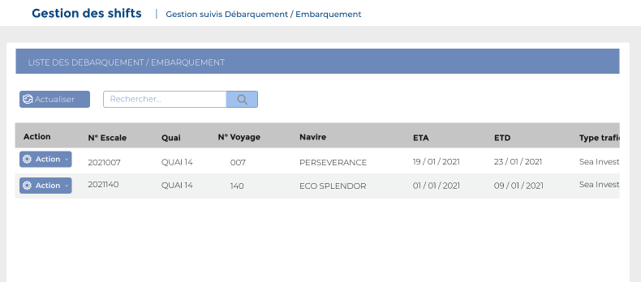
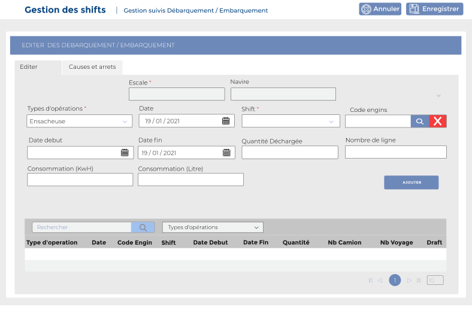
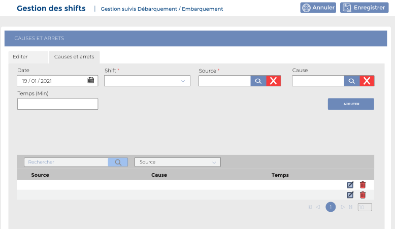

# Suivi Emb/Deb

Cette option permet la gestion suivis débarquement / embarquement .

### **Edition de la fiche : suivi Emb/Deb**

Pour saisir un suivis débarquement / embarquement, il faut cliquer sur le bouton **" Action"**, puis choisir **"Editer "** dans la liste déroulante. &#x20;

.PNG>)

Cette fiche se divise en deux onglets. La premier onglet présente les informations lier à l'embarquement débarquement . La deuxième partie concerne les causes et arrêts.

**Onglet: Opération navire**&#x20;

* **Escale :** Indiquez l'escale
* **Navire :** Indiquez le navire
* **Opération de type :** Indiquez le type d'opération&#x20;
* **Date :** Indiquez date
* **Shift :**  Indiquez le shift
* **Code engins :** Indiquez le code de l'engins
* **Date de début :** Indiquez la date de début&#x20;
* **Date Fin :** Indiquez la date de fin&#x20;
* **Quantité Déchargée :** Indiquez la quantité déchargée
* **Nombre Camion :** Indiquez le nombre de camion
* **Nombre voyage :** Indiquez le nombre de voyage&#x20;
* **Draft :** Indiquez le draft
* **Consommation / Kwh :** Indiquez la consommation en Kwh
* **Consommation / litre :** Indiquez la consommation en litre&#x20;

**Onglet: Causes et arrêts**&#x20;

* **Date :** Indiquez la date
* **Shift :** Indiquez le shift
* **Source Arrêt :** Indiquez la source d'arrêt
* **Temps Arrêt (Min) :** Indiquez le temps d'arrêt
* **Cause Arrêt :** Indiquez la cause d'arrêt

