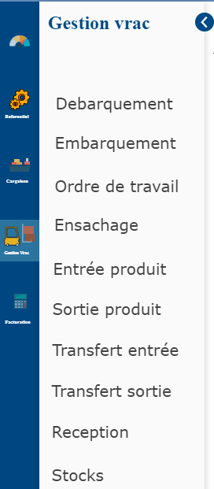

# Gestion Vrac

Ce module regroupe toutes les opérations effectuées sur le contenu d'un navire durant son accostage et les mouvements des produits dans de divers magasins.

### **Présentation du module : Gestion Vrac**

* **Débarquement**: cette fonctionnalité permet de matérialiser l'opération de débarquement des navires durant leurs accostages .
* **Embarquement** : cette fonction enregistre les opérations d'embarquement effectués par le navire.
* **Ordre de travail** : Cette fonctionnalité permet de matérialiser l'ordre donné par un client pour exécuter une opération de mélange ou d'ensachage  .
* **Ensachage** : Elle permet d'enregistrer l'opération d'ensachage des produits.
* **Entrée Produit** : Elle permet d'enregistrer les entrées de produits dans un magasin.
* **Sortie Produit** : Elle permet d'enregistrer les sorties de produits des magasins.
* **Transfert Entrée** : Elle permet d'enregistrer les réceptions de produits prévenants des magasins tierces.
* **Transfert Sortie** : Elle permet d'enregistrer les transfert de produits à destination des magasins tierces.
* **Stocks** : Elle permet de suivre les mouvements du stock des produits dans les magasins.

