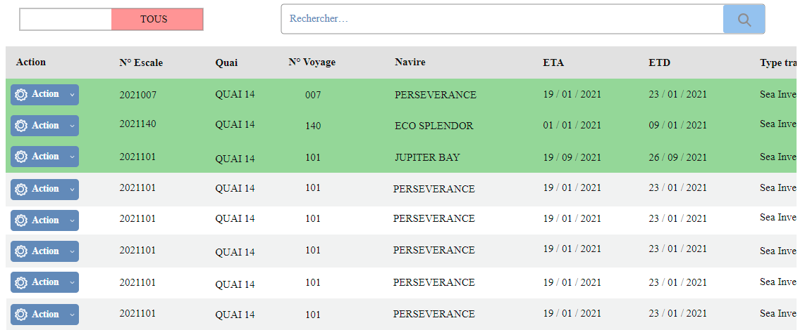
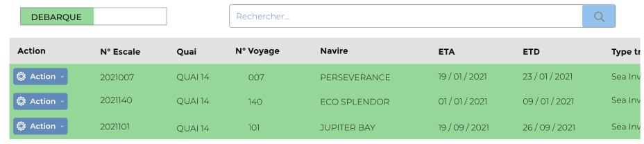
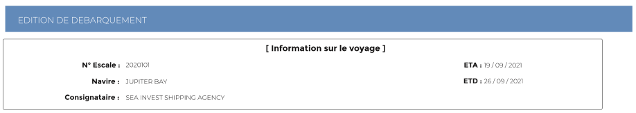
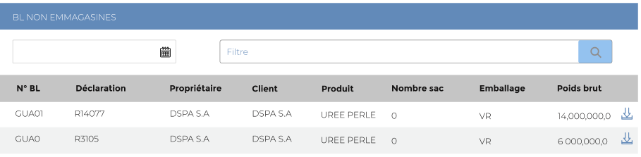
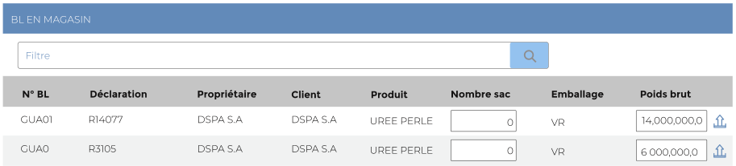

# Débarquements

Cette option permet de gérer les débarquements :

La liste des déchargements est composé de deux parties :

* La liste non colorée représente les escales non débarqués ou partiellement débarqués.

* La liste en  couleur verte représente les escales totalement débarqués.

### **Edition de la fiche : Débarquement**

Pour saisir un débarquement, il faut cliquer sur le bouton **" Action"**, puis choisir **"Editer "** dans la liste déroulante. &#x20;

.PNG>)

Cette fiche se divise en trois parties. La première présente les informations sur l'escale . La deuxième partie concerne la liste des **bill of lading** (**BL)** non débarqués présents sur l'escale et dans la troisième  partie la liste des **bill of lading** (**BL)** débarqués.

**1ère partie : Infos escale**

**NB:** Seule les zones en astérisque (\*) de cet écran sont obligatoire.

**2ème partie** : **Listes des BL non débarqués.**

* **Date** : Indiquez la date de débarquement.
* **Magasin** : indiquez le magasin de stockage du produit.
* **Bouton débarquer**  : cliquer sur ce bouton sur la ligne du **BL** pour débarquer le produit.

**3ème partie** : **Liste des BL débarqués et emmagasinés**

* **Nombre de sac**: indiquez le nombre de sac à débarquer.
* **Poids brut**: Indiquez le poids brut à débarquer .

