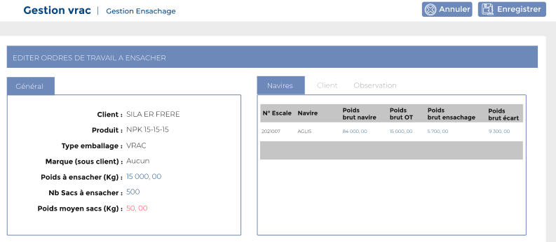
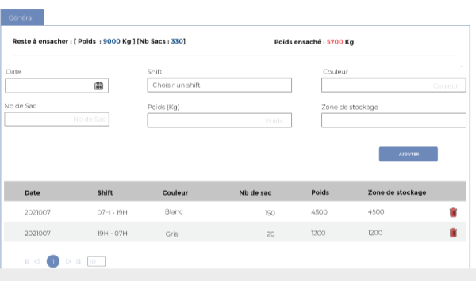

# Ensachages

Cette option permet de gérer les débarquements&#x20;

.PNG>)

### **Edition de la fiche : Ensachage**&#x20;

Pour saisir un ensachage, il faut cliquer sur le bouton **" Action"**, puis choisir **"Editer "** dans la liste déroulante. &#x20;

.PNG>)

Cette fiche se divise en trois parties. La première présente les informations: **générales, sur le navires, sur le client et les observation**. La deuxième partie concerne l'ensachage.

**1ère partie : Infos escale**

**2ème partie** : **Détail**

**NB:** Seule les zones en astérisque (\*) de cet écran sont obligatoire.

* **Date** : Indiquez la date de **l'ensachage**.
* **Shift** : indiquez le magasin de stockage du produit.
* **Couleur :** Indiquez la couleur
* **Nb de sac :** Indiquez le nombre de sac
* **Poids (Kg) :** Indiquez le poids&#x20;
* **Zone de stockage :** indiquez la zone de stockage

