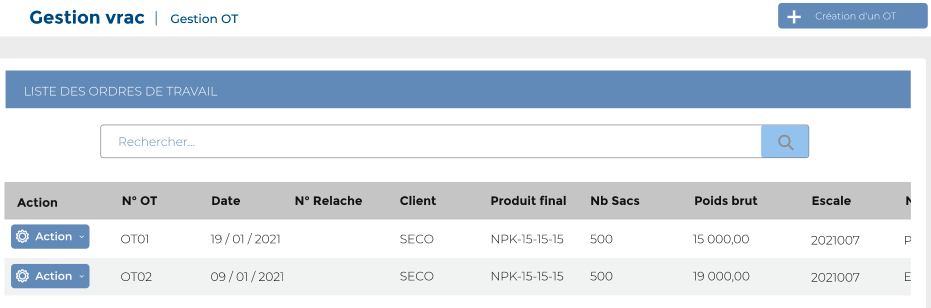

# Ordre de travail

Cette option permet de gérer les ordres de travail des clients.

### **Edition de la fiche : ordre de travail**

Cette fiche se divise en deux parties. La première partie présente les informations générales sur l'ordre de travail. La deuxième partie concerne le mélange des produits du client.

**1ère partie : Général**

* **N ° OT :** Indiquez le numéro de l'ordre de travail
* **Date OT :**  Indiquez le la date de l'ordre travail
* **N ° Relâche :** Indiquez le numéro de relâche&#x20;
* **N ° Déclaration :** Indiquez le numéro de déclaration
* **Produit Final :** Indiquez le produit final
* **Client :** Indiquez le client
* **Type Emballage :** Indiquez le type d'emballage
* **Marque :** Indiquez la marque
* **Nb Sacs :** Indiquez le nombre de sac&#x20;
* **Poids à Ensacher (kg) :** Indiquez le poids à ensacher

.PNG>)

**2 ère partie : Détail**

* **Produit :** Indiquez le produit
* **Poids disponible :**  Indiquez le poids disponible
* **Poids brut :** Indiquez le poids brut

