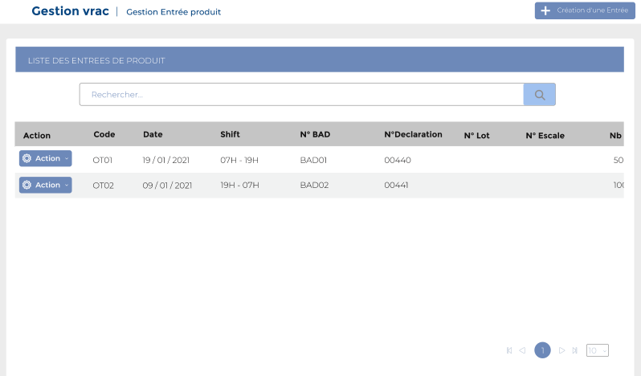
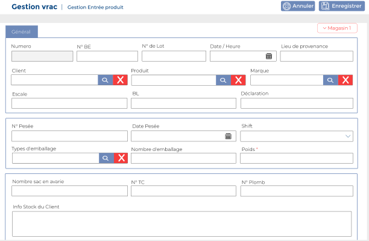

# Sorties Produits

Cette option permet de gérer les sorties produits.

### **Edition de la fiche : Sortes produits**

Cette fiche se divise en deux parties. La première partie présente les informations générales. La deuxième partie concerne la logistique.

**NB:** Seule les zones en astérisque (\*) de cet écran sont obligatoire.

**1ère partie : Général**

* **Numéro :** Indiquez le numéro
* **N ° BAD :** Indiquez le numéro BE
* **Date BAD :** Indiquez le numéro du lot
* **Destinataire :**  Indiquez le client&#x20;
* **Escale :** Indiquez l'escale
* **BL :** Indiquez le BL
* **Déclaration :** Indiquez la déclaration
* **Client :** Indiquez le client
* **Produit :** Indiquez le produit
* **Marque :** Indiquez la marque
* **N de lot :** Indiquez le numéro de lot
* **Ordre prélèvement :** Indiquez le l'ordre de prélèvement&#x20;
* **Date lot :** Indiquez l date de lot
* **N Pesée :** Indiquez le numéro de pesée&#x20;
* **Date pesée :** Indiquez la date
* **Shift :** Indiquez le shift
* **Type Emballage :** Indiquez le type emballage
* **Nb Emballage :** Indiquez le nombre emballage&#x20;
* **Poids (kg) :** Indiquez le poids
* **Nb Sacs en avarie :** Indiquez le le nombre sacs en avarie
* **N ° TC :** Indiquez le numéro TC
* **N ° Plomb :** Indiquez le plomb
* **Info stock client :** Indiquez le stock le client

**2 ère partie : La logistique**

1. Si la logistique utiliser est le **Un camion**&#x20;

* **Camion :** Indiquez le camion
* **Remorque :** Indiquez la remorque
* **Chauffeur :** Indiquez le chauffeur&#x20;
* **Divers camion :** Indiquez le camion divers
* **Divers remorque :** Indiquez le divers remorque
* **Divers Chauffeur :** Indiquez le divers chauffeur
* **N ° PC :** Indiquez le numéro du PC
* **Date PC :** Indiquez le la date du PC
* **Lieu Délivrance :** Indiquez le  lieu de délivrance&#x20;
* **PC Transporteur :** Indiquez le PC du transporteur

&#x20;    2\. Si la logistique utiliser est le **Un train**&#x20;

* **N ° Wagon :** Indiquez le numéro du Wagon
* **Wagon de Plomb :** Indiquez le Wagon de plomb
* **Transporteur :** Indiquez le transporteur&#x20;
* **Types d'emballage:** Indiquez le type d'emballage&#x20;
