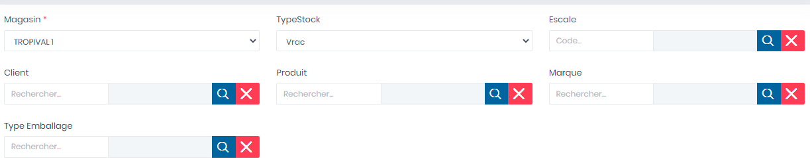
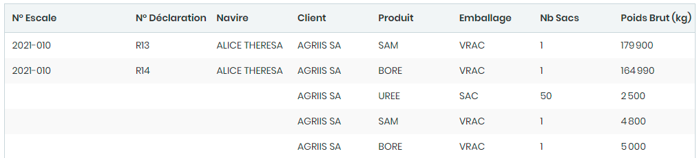

# Stocks

Cette fonctionnalité nous permet de consulter les niveaux de stock des produits avec des choix multicritères.

### **Edition de la fiche : Stocks**

Cette fiche se divise en deux parties. La première partie permet de saisir les informations générales lié à la recherche des stocks. La deuxième partie affiche la liste des stocks de produit recherché.

**1ère partie : Consultation de stock multicritère**

**2è partie : Liste des stocks**

