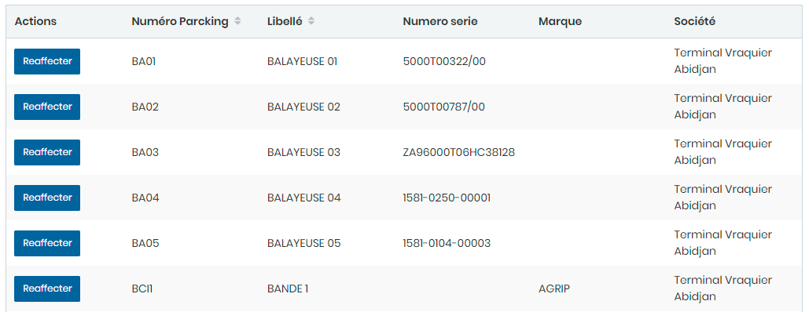
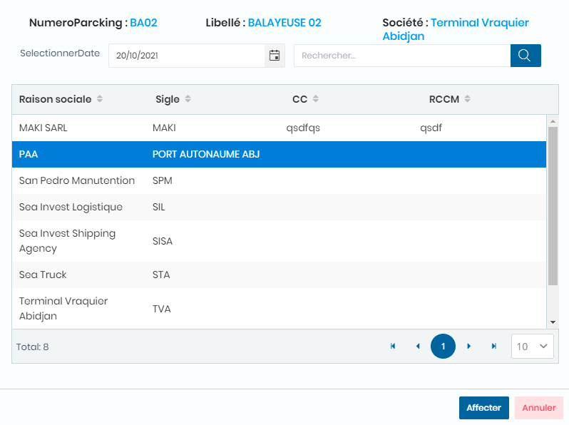

# Affectations Engins

Cette fonctionnalité permet de gérer les affectations d'engins

**Edition de la fiche : Affectation Engin**

* **Cliquez sur le bouton "Réaffecter" de la ligne concernée pour voir la liste des sociétés.**
* **Sélectionnez la société pour y réaffecter l'engin**

