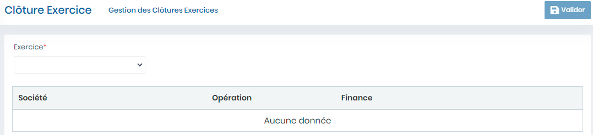

# Clôture Exercice

Cette fonctionnalité permet de clôturer les exercices

**Edition de la fiche : Clôture Exercice**

**NB :** Seule les zones en astérisque (\*) de cet écran sont obligatoires.

* **Exercice:**  Indiquez l'Exercice
* **Valider :** Cliquer sur le bouton **"Valider"** pour clôturer l'exercice.

