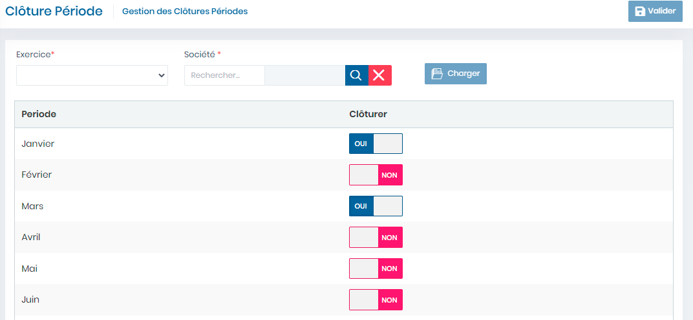

# Clôture Période

Cette fonctionnalité permet de clôturer les période de l'exercice

**Edition de la fiche : Clôture Période**

**NB :** Seule les zones en astérisque (\*) de cet écran sont obligatoires.

* **Exercice:**  Indiquez l'Exercice
* **Société** : Indiquez la société
* **Clôturer** : Choisir **"Oui"** pour clôturer une période
* **Valider :** Cliquer sur le bouton **"Valider"** pour enregistrer la clôture de la période.

