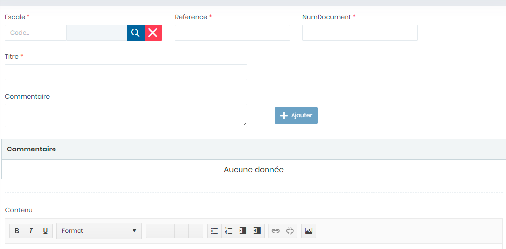

# Gestion Document

Cette fonctionnalité permet de gérer le document

**Edition de la fiche : Gestion Document**

**NB :** Seule les zones en astérisque (\*) de cet écran sont obligatoires.

* **Escale :**  Indiquez l'Escale
* **Reference** : Indiquez la référence
* **N° Document** : Indiquez le numéro de document
* **Titre :** Indiquez le titre du document .
* **Commentaire** : Indiquez la description

