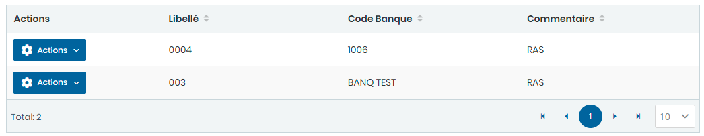

# Banques

Cette option permet la gestion des banques.

Cette fiche se divise en deux (2) parties.

* &#x20;La **première partie** concerne les saisie des informations générales sur la banque
* La **deuxième partie** concerne les saisies des contacts de la banque

**Edition de la fiche : Banque**&#x20;

**NB :** Seule les zones en astérisque (\*) de cet écran sont obligatoires.

**1 ère partie :**

* **Libellé** : Indiquez le nom de la banque.
* **Code Banque** : Indiquez le code de la banque.
* **Commentaire** : Indiquez les commentaires

**2ème Partie :  Contacts**

* **Ajouter** : Cliquez sur le bouton "**Ajouter**" pour ajouter des contacts dans le tableau ci dessous.

