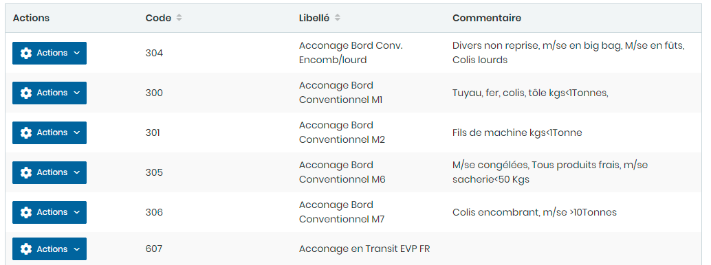
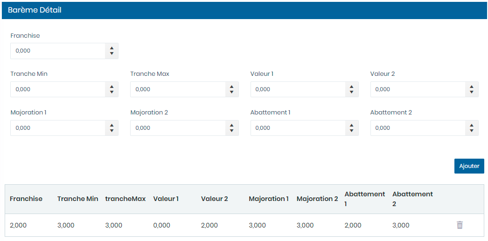

# Barèmes

Cette option permet la gestion des barèmes.

Cette fiche se divise en deux (2) parties.

* &#x20;La **première partie** concerne les saisie des informations générales sur le barèmes
* La **deuxième partie** concerne les saisies des détails du barèmes

**Edition de la fiche : Barème**

**NB :** Seule les zones en astérisque (\*) de cet écran sont obligatoires.

**1 ère partie :**

* **Code :** Indiquez le code.
* **Libellé** : Indiquez le libellé.
* **Commentaire** : Indiquez les commentaires

**2ème Partie : Détails Barèmes**

* **Franchise :** Indiquez le code.
* **Tranche Min** : Indiquez le libellé.
* **Tranche Max** : Indiquez les commentaires
* **Valeur 1 :** Indiquez la valeur 1
* **Valeur 2** : Indiquez la valeur 2
* **Majoration 1** : Indiquez la majoration 1
* **Majoration 2** : indiquez la majoration 2
* **Abattement 1** : Indiquez l'abattement 1
* **Abattement 2** : Indiquez l'abattement 2

