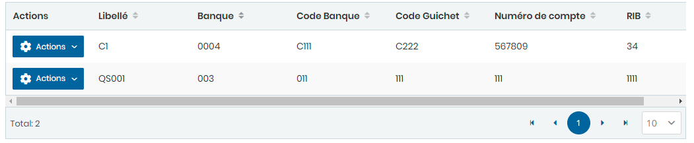
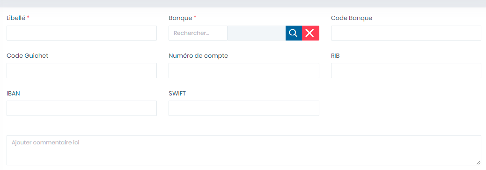
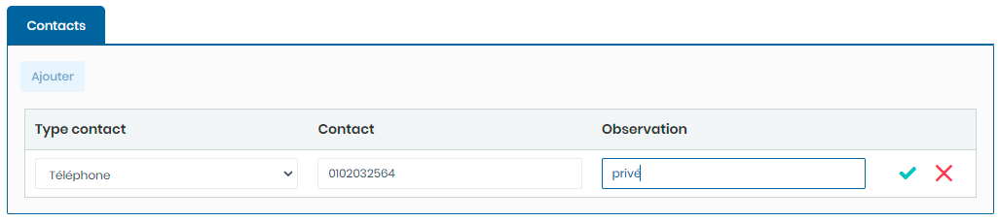

# Comptes Bancaires

Cette option permet la gestion des Comptes bancaires.

Cette fiche se divise en deux (2) parties.

* &#x20;La **première partie** concerne les saisie des informations générales sur le compte bancaire
* La **deuxième partie** concerne les saisies des contacts du titulaire du compte

**Edition de la fiche : Compte bancaire**

**NB :** Seule les zones en astérisque (\*) de cet écran sont obligatoires.

**1 ère partie :**

* **Libellé** : Indiquez le libellé.
* **Code Banque** : Indiquez le code de la banque.
* **Banque** : Indiquez la banque de domiciliation.
* **Code Guichet** : Indiquez le code guichet
* **Numéro de compte** : Indiquez le numéro de compte.
* **RIB** : indiquez le RIB
* **IBAN** : Indiquez l'IBAN
* **SWIFT** : Indiquez le SWIFT
* **Commentaire** : Indiquez les commentaires

**2ème Partie :  Contacts**

* **Ajouter** : Cliquez sur le bouton "**Ajouter**" pour ajouter des contacts dans le tableau ci dessous.

