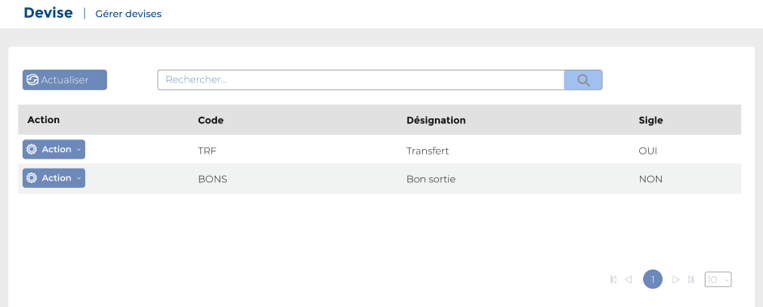
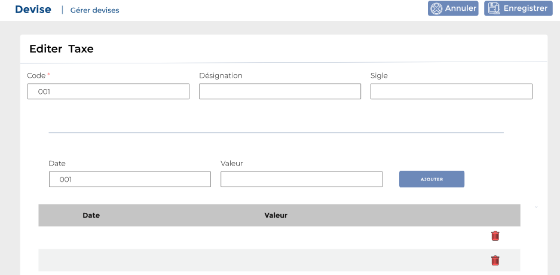

# Devise

Cette option permet de gérer les devises.

**Edition de la fiche : Devise**

**NB :** Seule les zones en astérisque (\*) de cet écran sont obligatoires.

* **Code :** Indiquez le code
* **Désignation :** Indiquez la désignation
* **Sigle :** Indiquez le sigle
* **Date** **:** Indiquez la date&#x20;

