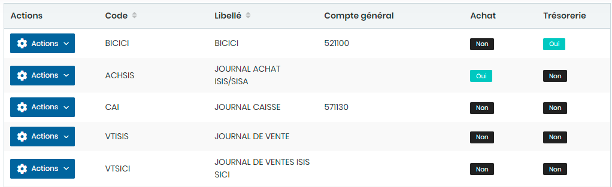
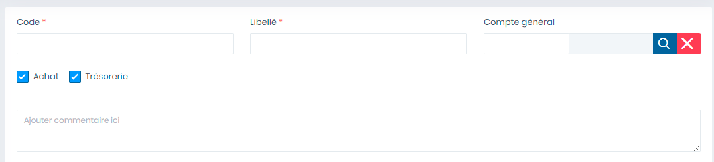

# Journaux

Cette option permet de gérer les journaux .

**Edition de la fiche : Journaux**

**NB :** Seule les zones en astérisque (\*) de cet écran sont obligatoires.

* **Code :** Indiquez le code
* **Libellé :** Indiquez le libellé
* **Compte général** : Indiquez le compte général
* **Achat** : Cocher :ballot\_box\_with\_check: pour signifier dans l'achat .
* **Trésorerie** : Cocher :ballot\_box\_with\_check: pour signifier dans la trésorerie .

