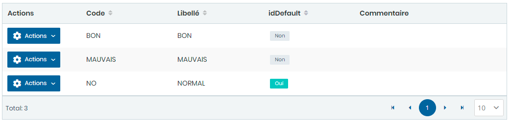

# Motifs factures

Cette option permet de gérer les motifs de facture .

**Edition de la fiche : Motifs facture**

**NB :** Seule les zones en astérisque (\*) de cet écran sont obligatoires.

* **Code :** Indiquez le code
* **Libellé :** Indiquez le libellé
* **Par défaut** : Choisir **"Oui "** pour prendre en compte le motif par défaut.

