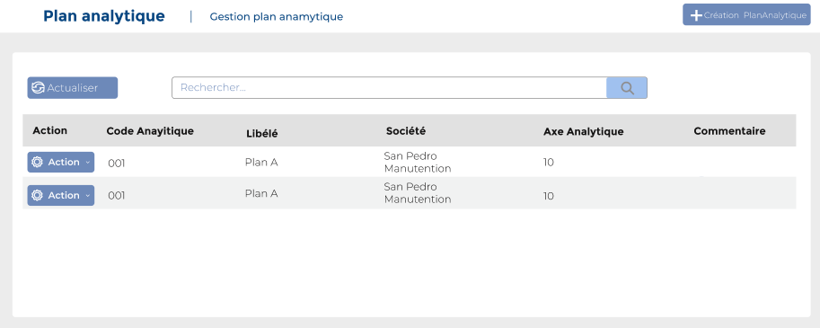
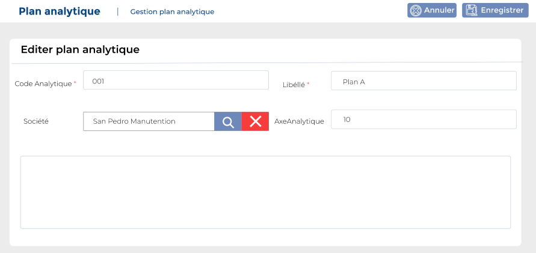

# Plans analytiques

Cette option permet de gérer les plans analytiques.

**Edition de la fiche : Plan analytique**

**NB :** Seule les zones en astérisque (\*) de cet écran sont obligatoires.

* **Code analytique:** Indiquez le numéro
* **Libellé :** Indiquez le libellé
* **Société :** Indiquez la société&#x20;
* **Axe Analytique :** Indiquez l'axe  analytique
* **Commentaire :** Indiquez le commentaire

