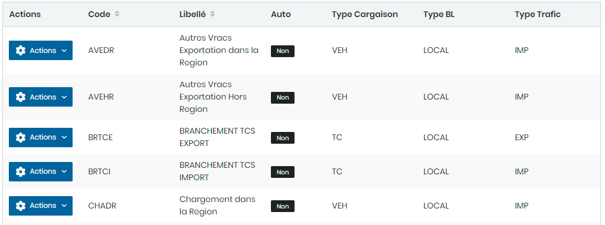
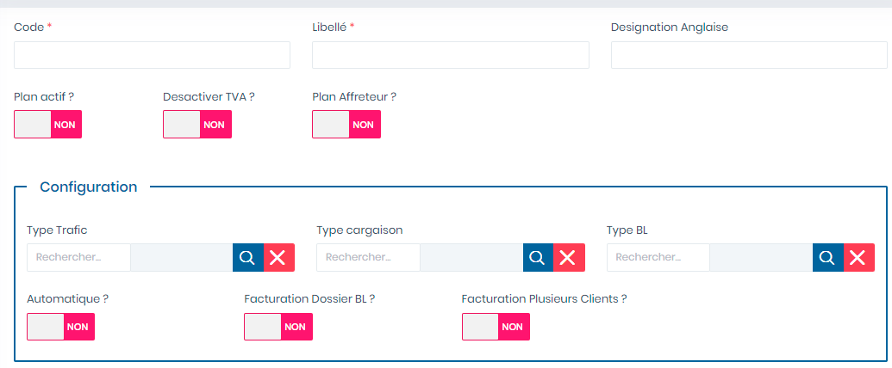
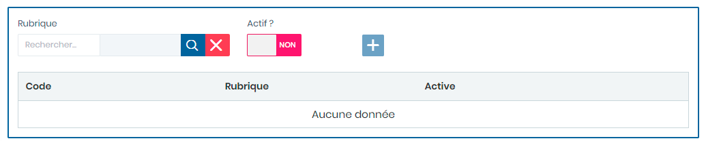

# Plans Factures

Cette option permet la gestion des plans de factures.

Cette fiche se divise en deux (2) parties.

* &#x20;La **première partie** concerne les saisie des paramètre généraux pour le plan de facture&#x20;
* La **deuxième partie** concerne les rubriques qui s'afficherons dans la facture

**Edition de la fiche : Plan de facture**

**NB :** Seule les zones en astérisque (\*) de cet écran sont obligatoires.

**1 ère partie :**

* **Code** : Indiquez le code
* **Libellé** : Indiquez le libellé
* **Désignation Anglaise** : Indiquez la désignation en langue Anglaise
* **Plan actif ? :** Choisir **"Oui "** pour activer le plan dans la facturation
* **Désactiver TVA ? :** Choisir **"Oui "** pour ne pas  prendre en compte la taxe TVA dans la facturation du client.
* **Plan Affréteur ? : Choisir "Oui "** pour prendre en compte l'Affréteur dans la facturation
* **Type Trafic :**  Indiquez le type de trafic
* **Type cargaison  :** Indiquez le type de cargaison
* **Type BL** : Indiquez le type de BL
* **Automatique ?** : Choisir **"Oui "** pour automatiser le plan.
* **Facturation Dossier BL ?** : Choisir **"Oui "** pour prendre en compte la facturation du dossier BL&#x20;
* **Facturation Plusieurs Clients ?** : Choisir **"Oui "** pour prendre en compte la facturation de plusieurs clients

**2ème partie :**

* **Rubrique :**  Indiquez la rubrique
* **Actif ?** : Choisir **"Oui "** pour rendre la rubrique actif dans sur la facture&#x20;
* **Cliquer sur le bouton** :cross:  pour ajouter une ligne dans le tableaux ci dessous.

