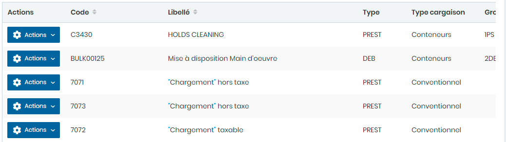
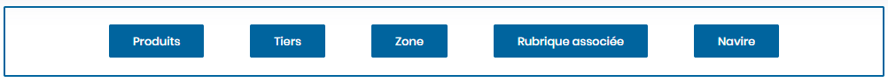
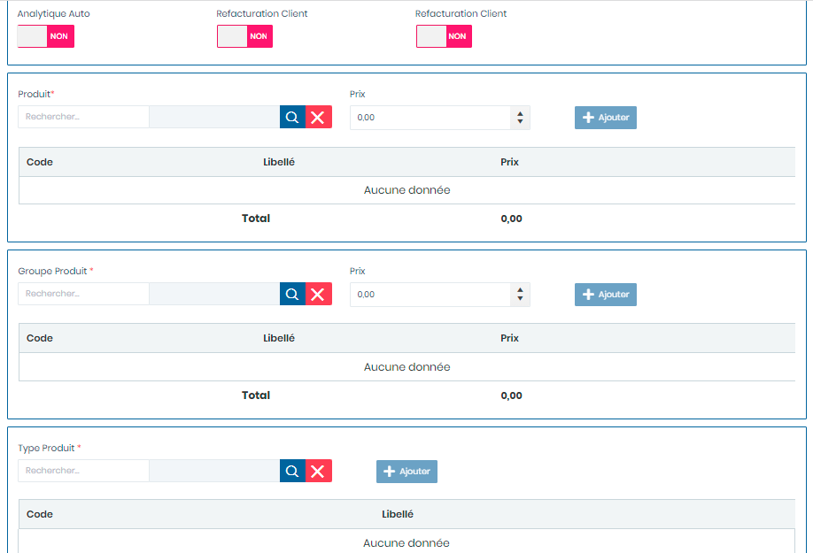
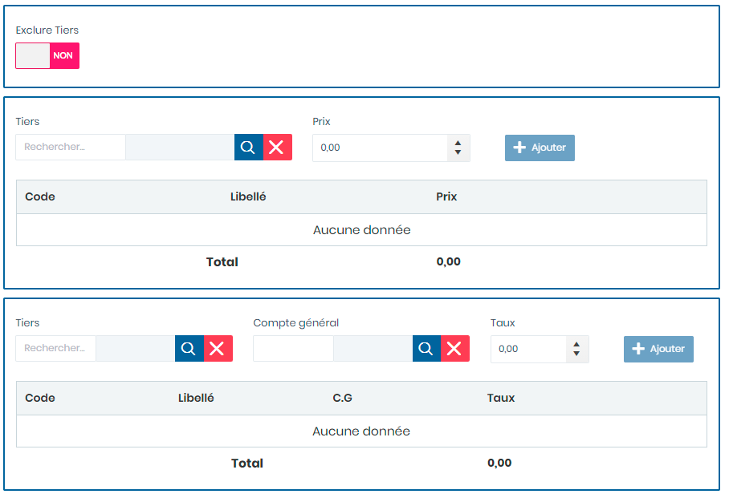
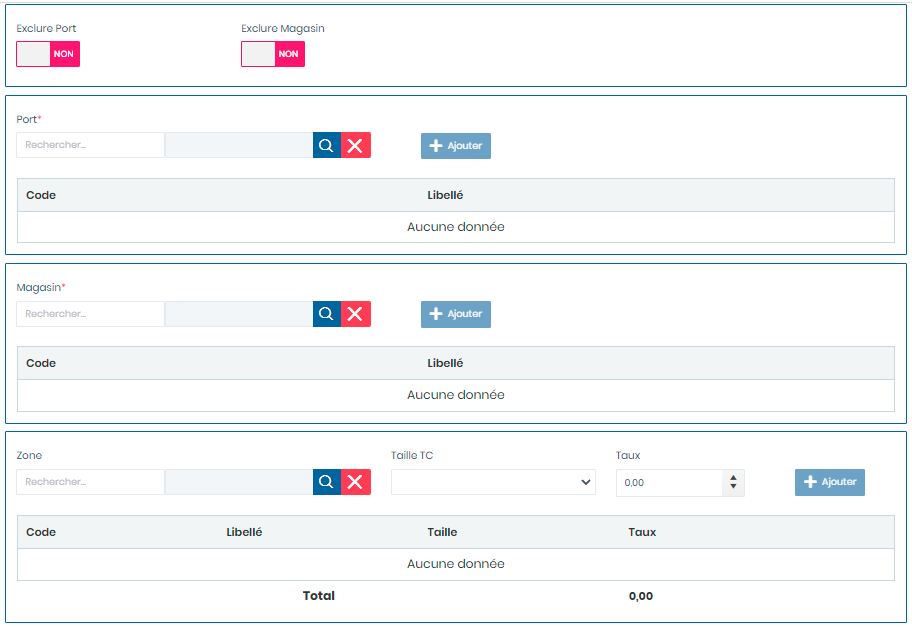
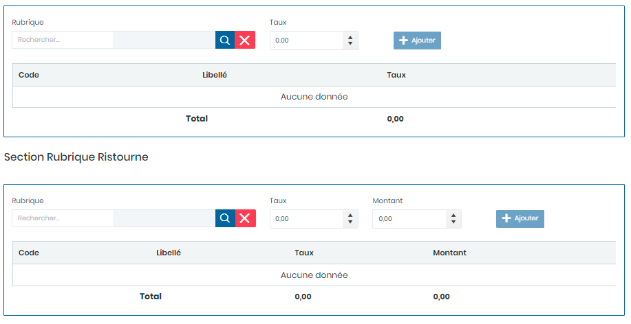
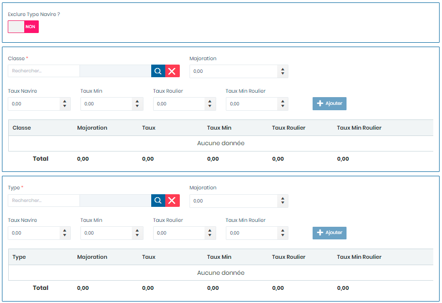
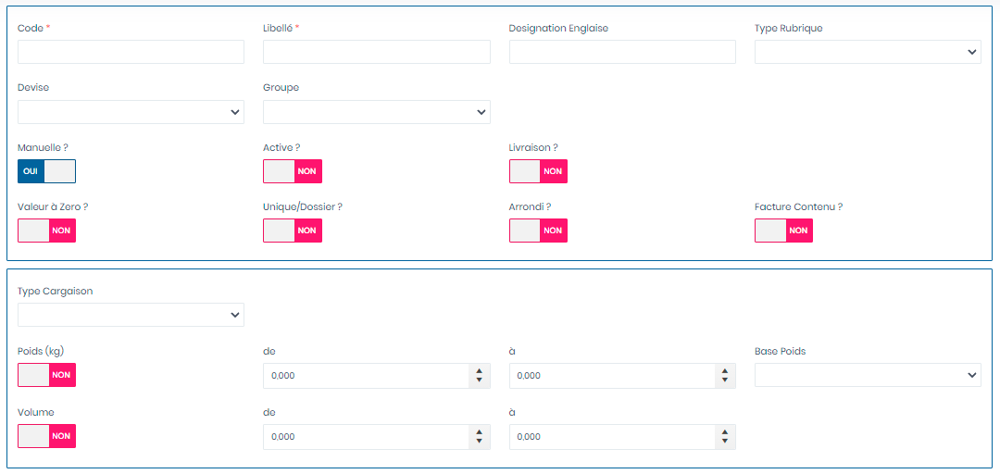

# Rubriques

Cette option permet la gestion les rubriques.

**Edition de la fiche : Rubriques**

Cette fiche se divise en deux (2) parties.

* &#x20;La **première partie** concerne les saisie des paramètres tels que : **les produits, les tiers, les zones, les rubriques associées et les navires.**
* La **deuxième partie** concerne le paramétrage général sur les rubriques à facturer

**1ère partie :**

**Edition de la fiche : Produits**

**NB :** Seule les zones en astérisque (\*) de cet écran sont obligatoires.

* **Analytique Auto:** Choisir **"Oui "** pour autoriser la comptabilisation analytique
* **Refacturation Client :** Choisir **"Oui "** pour refacturer le client.
* **Comptabilisation Client : Choisir "Oui "** pour comptabiliser le client
* **Produit :**  Indiquez le produit
* **Prix  :** Indiquez le prix
* **Ajouter :** Cliquez sur le bouton **"Ajouter"** pour ajouter une ligne dans le tableaux ci dessous.

* **Groupe Produit** : Indiquez le groupe produit
* **Prix** : Indiquez le prix
* **Ajouter :** Cliquez sur le bouton **"Ajouter"** pour ajouter une ligne dans le tableaux ci dessous.

* **Type Produit** : Indiquez le type produit &#x20;
* **Ajouter :** Cliquez sur le bouton **"Ajouter"** pour ajouter une ligne dans le tableaux ci dessous.

**Edition de la fiche : Tiers**

**NB :** Seule les zones en astérisque (\*) de cet écran sont obligatoire.

* **Exclure Tiers :** Choisir **"Oui "** pour exclure la facturation du tiers
* **Tiers :**  Indiquez le tiers
* **Prix  :** Indiquez le prix
* **Ajouter :** Cliquez sur le bouton **"Ajouter"** pour ajouter une ligne dans le tableaux ci dessous.

* **Tiers** : Indiquez le tiers
* **Compte général** : Indiquez le compte général
* **Taux** : Indiquez le taux.
* **Ajouter :** Cliquez sur le bouton **"Ajouter"** pour ajouter une ligne dans le tableaux ci dessous.

**Edition de la fiche : Zone**

**NB :** Seule les zones en astérisque (\*) de cet écran sont obligatoire.

* **Exclure Port :** Choisir **"Oui "** pour exclure la facturation du port
* **Exclure Magasin :**  Choisir **"Oui "** pour exclure la facturation du magasin

* **Port  :** Indiquez le port
* **Ajouter :** Cliquez sur le bouton **"Ajouter"** pour ajouter une ligne dans le tableaux ci dessous.

* **Magasin  :** Indiquez le magasin
* **Ajouter :** Cliquez sur le bouton **"Ajouter"** pour ajouter une ligne dans le tableaux ci dessous.

* **Zone  :** Indiquez la zone de livraison
* **Taille Tc** : Indiquez la taille du conteneur
* **Taux** : Indiquez le taux.
* **Ajouter :** Cliquez sur le bouton **"Ajouter"** pour ajouter une ligne dans le tableaux ci dessous.

**Edition de la fiche : Rubriques Associées**

**NB :** Seule les zones en astérisque (\*) de cet écran sont obligatoire.

* [x] **Section Rubrique Associés**

<!---->

* **Rubrique  :** Indiquez la rubrique.
* **Taux  :**  Indiquez le taux.
* **Ajouter :** Cliquez sur le bouton **"Ajouter"** pour ajouter une ligne dans le tableaux ci dessous

* [x] **Section Rubrique Ristourne**

<!---->

* **Rubrique  :** Indiquez la rubrique.
* **Taux  :**  Indiquez le taux.
* **Montant :** Indiquez le montant
* **Ajouter :** Cliquez sur le bouton **"Ajouter"** pour ajouter une ligne dans le tableaux ci dessous

* **Magasin  :** Indiquez le magasin
* **Ajouter :** Cliquez sur le bouton **"Ajouter"** pour ajouter une ligne dans le tableaux ci dessous.

**Edition de la fiche : Navire**

**NB :** Seule les zones en astérisque (\*) de cet écran sont obligatoire.

* **Exclure Type Navire ? :** Choisir **"Oui "** pour exclure le type de navire
* **Classe :**  Indiquez la classe navire.
* **Majoration** : Indiquez la majoration.
* **Taux Navire** : Indiquez le taux.
* **Taux Min** : Indiquez le taux minimal.
* **Taux Roulier** : Indiquez le taux roulier.
* **Taux Min Roulier** : Indiquez le taux minimal roulier.
* **Ajouter :** Cliquez sur le bouton **"Ajouter"** pour ajouter une ligne dans le tableaux ci dessous.

* **Taux Navire** : Indiquez le taux.
* **Majoration** : Indiquez la majoration
* **Taux Min** : Indiquez le taux minimal.
* **Taux Roulier** : Indiquez le taux roulier.
* **Taux Min Roulier** : Indiquez le taux minimal roulier.
* **Ajouter :** Cliquez sur le bouton **"Ajouter"** pour ajouter une ligne dans le tableaux ci dessous.

**2ème partie :**

**NB :** Seule les zones en astérisque (\*) de cet écran sont obligatoire.

* **Code** : Indiquez le code.
* **Libellé** : Indiquez le libellé.
* **Désignation Anglaise** : Indiquez la désignation en langue anglaise.
* **Type Rubrique** : Indiquez le type de rubrique
* **Devise** : Indiquez la devise
* **Groupe** : Indiquez le groupe
* **Manuelle ? :** Choisir **"Oui "** pour autoriser la comptabilisation manuelle
* **Active ? :** Choisir **"Oui "** pour activer les options de facturation.
* **Livraison ? : Choisir "Oui "** pour autoriser la facturation sur la livraison
* **Valeur à Zéro ? : Choisir "Oui "** pour remettre a valeur à zéro
* **Unique/Dossier ? : Choisir "Oui "** pour activer l'unicité du dossier
* **Arrondi ? : Choisir "Oui "** pour autoriser les arrondi des nombres
* **Facture Contenu ? : Choisir "Oui "** pour comptabiliser le contenu de la facture

* **Type Cargaison :**  Indiquez le type de cargaison
* **Poids (kg) :** Choisir **"Oui "** pour tenir compte du poids
* **de  :** Indiquez la plage de début du poids
* **à** : Indiquez la plage de fin du poids
* **Base Poids** : Indiquez la base de calcul du poids
* **Volume :** Choisir **"Oui "** pour tenir compte du volume
* **de** : Indiquez la plage de début du volume
* **à** : indiquez la plage de fin du volume

* **Base Tarification** : Indiquez le type de cargaison.
* **Pondération** : Indiquez la pondération.
* **Barème** : Indiquez le barème
* **Tranche** : Choisir **"Oui "** pour tenir compte de la tranche
* **Voir** : Choisir **"Oui "** pour voir
* **Appliquer produit Dangereux** : Choisir **"Oui "** pour appliquer cette option
* **Type Tarification** : indiquez le type de tarification
* **Taux** : Indiquez le taux
* **Nb Jrs Calculé** : Indiquez le nombre de jour calculé
* **Tranche Horaire** : Indiquez la tranche horaire
* **Valeur Max** : Choisir **"Oui "** pour appliquer cette option
* **Valeur** : Indiquez la valeur
* **Poids supérieur** : Indiquez la valeur supérieur
* **Volume supérieur** : Indiquez le volume supérieur
* **Type Marge** : Indiquez le type de marge
* **Taux de Marge** : Indiquez le taux de la marge
* **Marge En (%)** : Choisir **"Oui "** pour appliquer cette option
* **Taxe** : Indiquez la taxe.
* **Sens CG** : Indiquez le sens Comptabilité Générale
* **Sens CG Auxiliaire** : Indiquez le sens comptabilité auxiliaire
* **Compte général** : Indiquez le compte général
* **Compte analytique** : Indiquez le compte analytique
* **Analytique Auto ?** : Choisir **"Oui "** pour appliquer cette option
* **Refacturation Client ?** : Choisir **"Oui "** pour appliquer cette option
* **Comptabilisation Client ?** : Choisir **"Oui "** pour appliquer cette option
* **Comptabilisation Fournisseur ?** : Choisir **"Oui "** pour appliquer cette option

