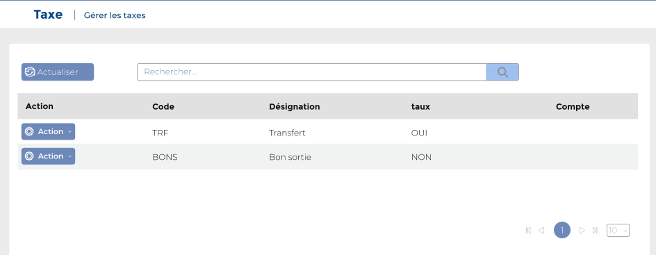
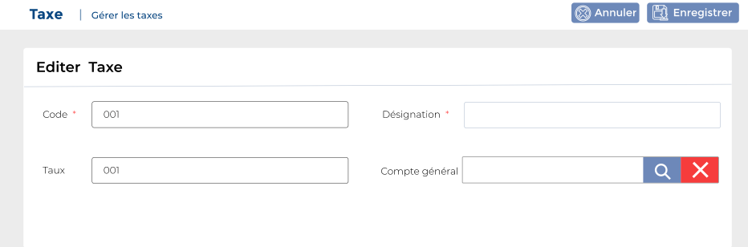

# Taxes

Cette option permet de gérer les taxes.

**Edition de la fiche : Taxes**

**NB :** Seule les zones en astérisque (\*) de cet écran sont obligatoires.

* **Code :** Indiquez le code
* **Désignation :** Indiquez la désignation
* **Taux :** Indiquez le taux
* **Compte général :** Indiquez le compte général

