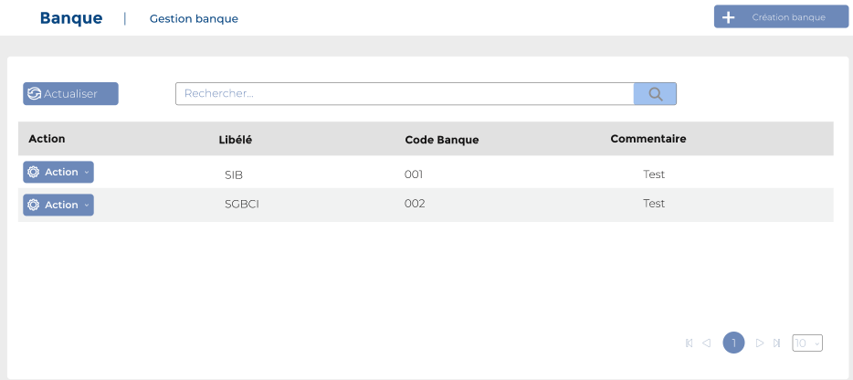
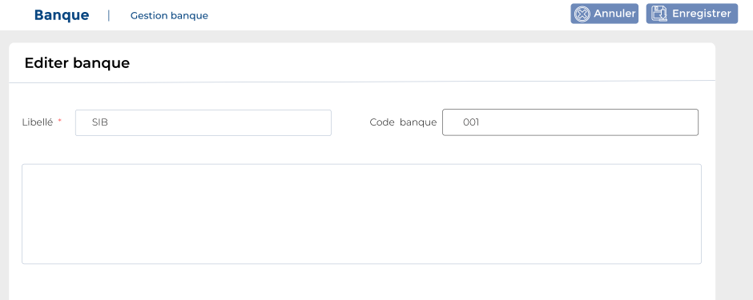

# Banques

Cette option permet de gérer les banques.

### **Edition de la fiche : Banques**

Cette fiche se divise en deux parties. La première partie présente les informations signalétiques de la banque et dans la deuxième partie les contacts.

**NB :** Seule les zones en astérisque (\*) de cet écran sont obligatoire.

* **Libellé:** Indiquez le libellé.
* **Code banque:** Indiquez le code banque.

**Onglet : Contact**

Cet onglet vous permet d'ajouter les contacts de la société  : cliquez sur le bouton "**Ajouter contact**"

* **Type contact** : indiquez le type de contact
* **Libellé** : indiquez le libellé

.PNG>)
