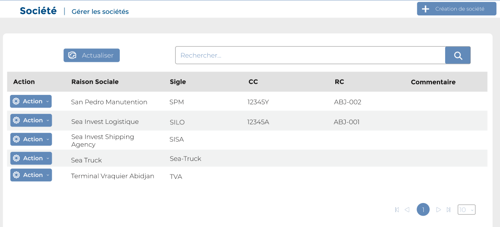
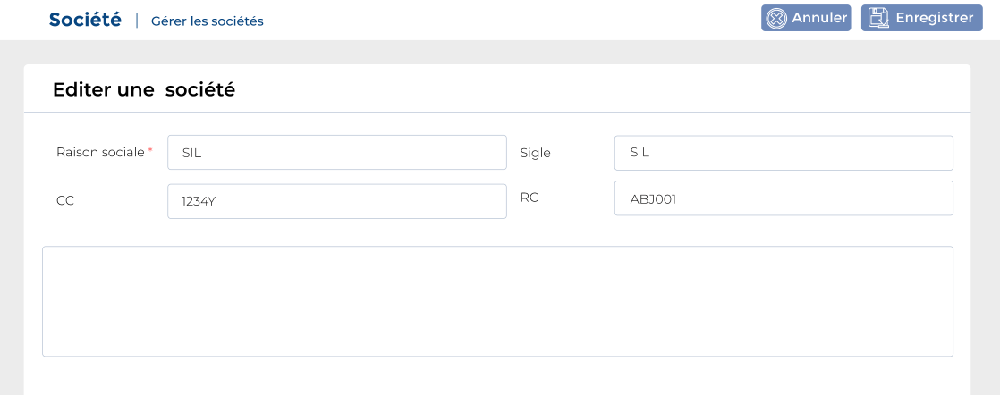
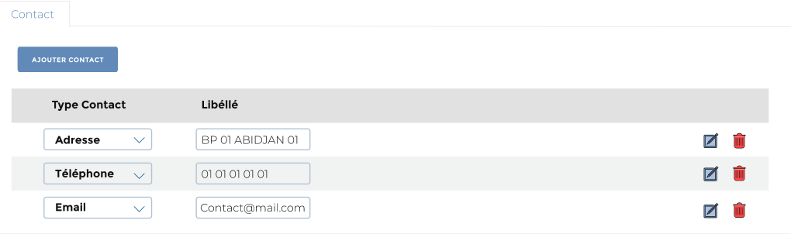

# Société

Cette option permet de gérer les sociétés

### **Edition de la fiche : Société**

Cette fiche se divise en deux parties. La première partie présente les informations signalétiques de la société et dans la deuxième partie les contacts.

**NB:** Seule les zones en astérisque (\*) de cet écran sont obligatoire.

* **Raison sociale**: Indiquez la raison sociale.
* **Sigle**: Sélectionnez le sigle de la société.
* **RC (Registre de commerce)** : Indiquez le numéro du registre de commerce de la société.
* **CC (Compte contribuable)** : Indiquez le numéro de compte contribuable de la société.
* **Commentaire** : Indiquez le commentaire.

**Onglet : Contact**

Cet onglet vous permet d'ajouter les contacts de la société  : cliquez sur le bouton "**Ajouter contact**"

* **Type contact** : indiquez le type de contact
* **Libellé** : indiquez le libellé

