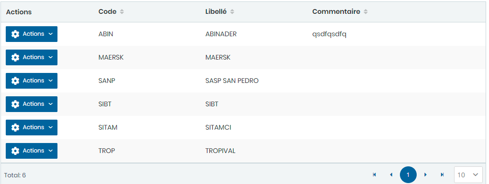

# Sites

Cette option permet de gérer les sites

### **Edition de la fiche : Site**

**NB:** Seule les zones en astérisque (\*) de cet écran sont obligatoire.

* **Code** : Indiquez la code.
* **Libelle**: Indiquez la désignation
* **Commentaire** : Indiquez le commentaire.

###
