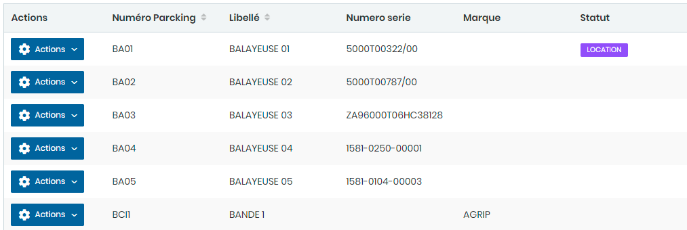
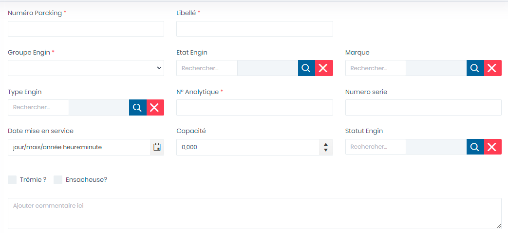
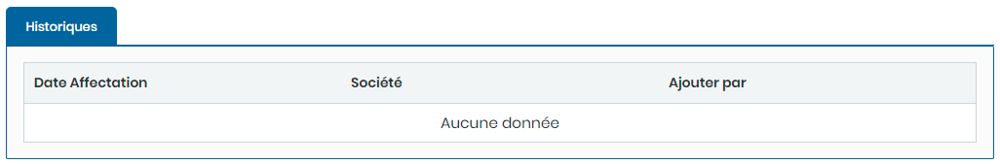

# Engins

Cette option permet de gérer les Engins.

**Edition de la fiche : Engins**

Cette fiche se divise en deux parties. La première partie présente les informations signalétiques des engins et dans la deuxième partie les Historique.

**NB :** Seule les zones en astérisque (\*) de cet écran sont obligatoire.

* **Numéro Packing  :** Indiquez le numéro de packing
* **Libellé :** Indiquez le libellé
* **Société :**   Indiquez la société
* **Etat Engin :**  Indiquez l'état engin
* **Marque :** Indiquez la marque&#x20;
* **Type Véhicule :**  Indiquez le type véhicule
* **N° Analytique :** Indiquez le numéro analytique&#x20;
* **Numéro série :** Indiquez le numéro de série
* **Date mise en service :** Indiquez la date de mise en service.
* **Capacité :** Indiquez la capacité

**Onglet : Historiques**

Cet onglet vous permet de visualiser les historiques des informations.

