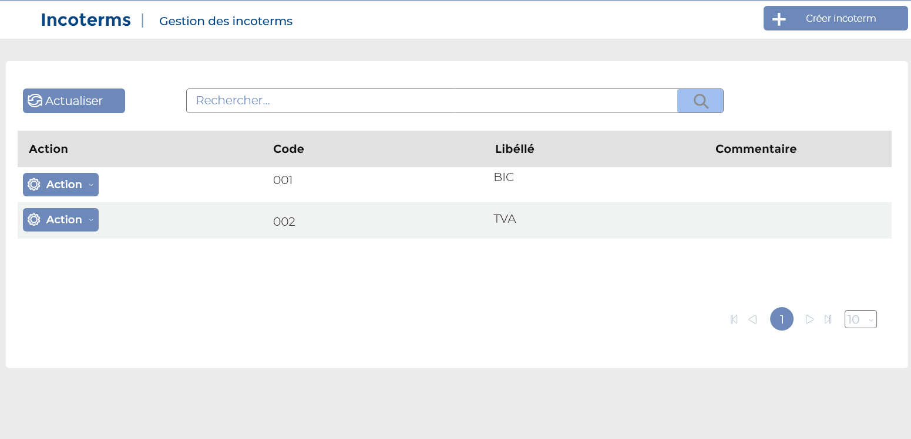

# Incoterms

Cette option permet de gérer les incoterms.

### **Edition de la fiche :** incoterms&#x20;

**NB :** Seule les zones en astérisque (\*) de cet écran sont obligatoire.

* **Code :** Indiquez le code.
* **Libellé:** Indiquez le libellé.
* **Commentaire :** Indiquez le commentaire.

.png>)

