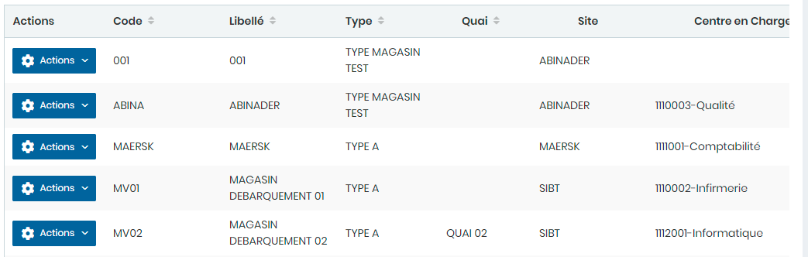
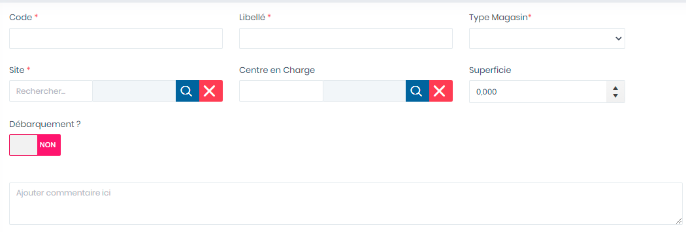

# Magasin

Cette option permet de gérer les magasins.

### **Edition de la fiche :** Magasin&#x20;

**NB :**Seule les zones en astérisque (\*) de cet écran sont obligatoire.

* **Code :** Indiquez le code.
* **Libelle:** Indiquez la désignation.
* **Type Magasin** : Indiquez le type de magasin
* **Site:** Indiquez le site&#x20;
* **Centre en Charge** : Indiquez le centre
* **Superficie** : indiquez la superficie
* **Débarquement ?** : Choisir **"Oui"** pour un magasin de débarquement
* **Commentaire :** Indiquez le commentaire.

