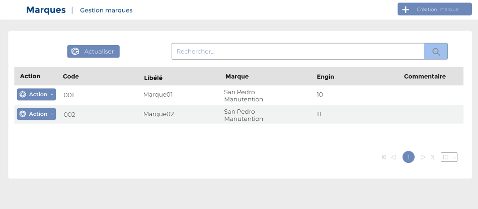

# Marques

Cette option permet de gérer les marques.&#x20;

### **Edition de la fiche :** Marques

**NB :** Seule les zones en astérisque (\*) de cet écran sont obligatoire.

* **Code :** Indiquez le code.
* **Libellé:** Indiquez le libellé.
* **Emballage** : Cochez le type emballage
* **Engin** : Cochez le type engin&#x20;
* **Commentaire :** Indiquez le commentaire.

.PNG>)
