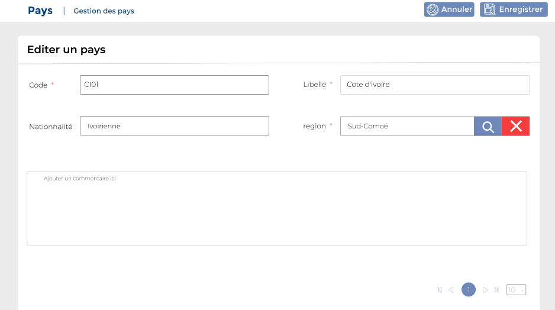

# Pays

Cette option permet de gérer les pays.

### **Edition de la fiche :** Pays

**NB :** Seule les zones en astérisque (\*) de cet écran sont obligatoire.

* **Code :** Indiquez le code.
* **Libellé :** Indiquez la désignation.
* **Nationalité :** Indiquez la nationalité.
* **Région :** Indiquez la région
* **Commentaire:** Indiquez le commentaire.

