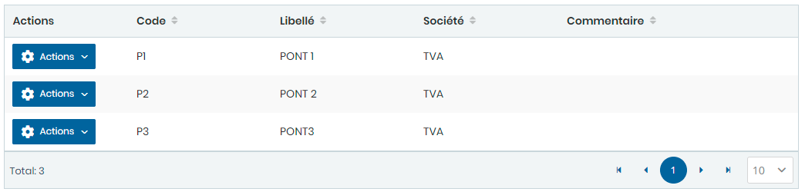
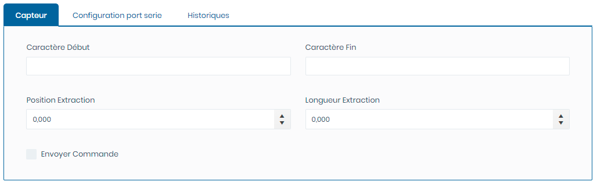
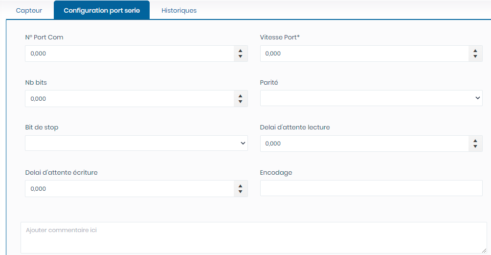
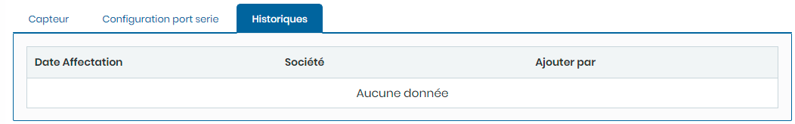

# Ponts Bascules

Cette option permet de gérer les Ponts Bascules.

**Edition de la fiche : Ponts Bascules**

Cette fiche se divise en deux parties. La première partie présente les informations signalétiques de la du pont bascule et dans la deuxième partie les informations relatives aux capteur,  Configuration port série et aux historiques.

**NB :** Seule les zones en astérisque (\*) de cet écran sont obligatoire.

* **Code:** Indiquez le code.
* **Libellé:** Indiquez le libellé

**Onglet : Capteur**

* **Caractère Début :** Indiquez le caractère du début de la trame
* **Caractère Fin :** Indiquez le caractère du début de la trame
* **Position Extraction :** Indiquez le position d'extraction du poids dans la trame
* **Longueur Extraction :** Indiquez la longueur de lecture du poids dans la trame
* **Envoyer Commande:** Indiquez la commande à envoyer **si le pont est en mode discontinue**

**Onglet : Configuration port série**

* **N° Port Com :**  Indiquez le numéro du port série
* **Vitesse Port :** Indiquez la vitesse du port série
* &#x20;**Nb bits :** Indiquez le nombre de bits du port série
* **Parité :** Indiquez la parité du port série
* **Bit de stop :** Indiquez le bit d'arrêt du port série
* **Délai d'attente lecture :** Indiquez le délai d'attente de lecture de la trame
* **Délai d'attente écriture :** Indiquez le délai d'attente d'écriture de la trame
* **Encodage :** Indiquez l'encodage du port série
* **Commentaire :** Indiquez les commentaires

**Onglet : Historiques :**

Ce onglet affiche l'historique des sociétés ayant utilisés ce pont bascule

