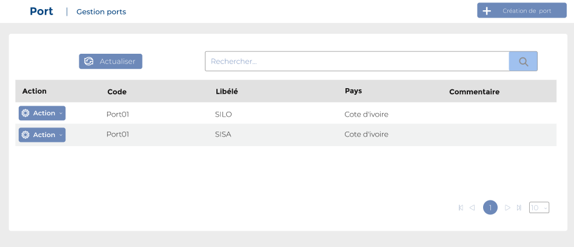
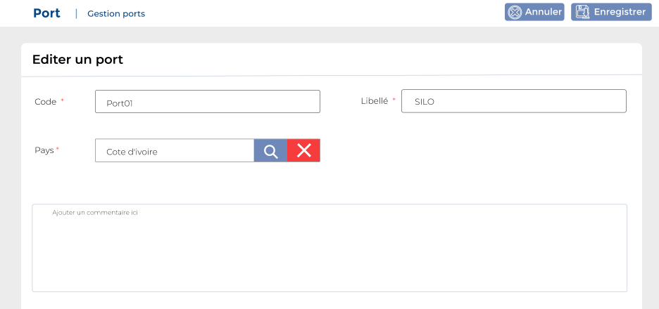

# Ports

Cette option permet de gérer les ports&#x20;

### **Edition de la fiche : Ports**

**NB :** Seule les zones en astérisque (\*) de cet écran sont obligatoire.

* **Code :** Indiquez le code.
* **Libellé :** Indiquez la libellé.
* **Pays:** Indiquez la pays
* **Commentaire :** Indiquez le commentaire.

